# python-oracledb Thin Mode 아키텍처 문서

> **대상 독자**: 프로젝트에 처음 합류하는 신입 개발자  
> **범위**: Thin 모드 한정 (Oracle Client 라이브러리 없이 직접 TNS 프로토콜 통신)

---

## 1. 프로젝트 개요

`python-oracledb`는 Python에서 Oracle Database에 접속하기 위한 드라이버입니다.  
[PEP 249 (Python DB-API 2.0)](https://peps.python.org/pep-0249/) 표준을 준수하며, **Cython**으로 작성되어 네이티브 C 확장 모듈로 컴파일됩니다.

### 1.1 Thin 모드란?

- Oracle Client 라이브러리(OCI) **없이** 동작
- 순수 Python/Cython으로 TNS(Transparent Network Substrate) 프로토콜을 직접 구현
- 설치 의존성이 최소화되어 배포가 간편

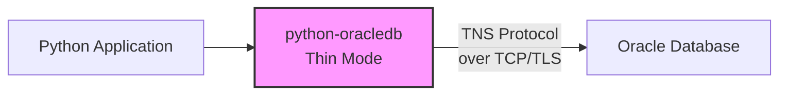

---

## 2. 계층 구조 (Layered Architecture)

프로젝트는 명확한 **3계층 구조**로 설계되어 있습니다.

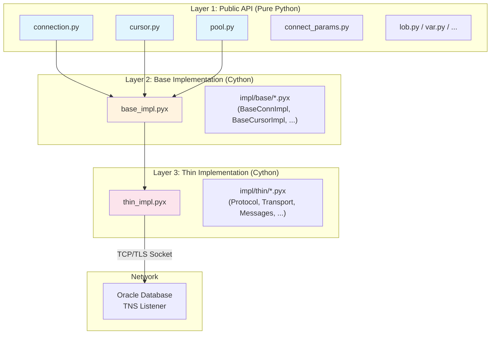

| 계층 | 역할 | 파일 위치 |
|------|------|-----------|
| **Public API** | 사용자에게 노출되는 Python 클래스 (`Connection`, `Cursor`, `Pool`) | `src/oracledb/*.py` |
| **Base Impl** | 공통 로직 (바인딩, 타입 변환, 파싱 등). Thin/Thick 모두 공유 | `src/oracledb/base_impl.pyx` → `impl/base/` |
| **Thin Impl** | TNS 프로토콜 직접 구현 (소켓, 패킷, 메시지) | `src/oracledb/thin_impl.pyx` → `impl/thin/` |

---

## 3. Cython 빌드 구조

Cython `.pyx` 파일은 `include` 문을 통해 여러 파일을 **하나의 컴파일 단위**로 합칩니다.

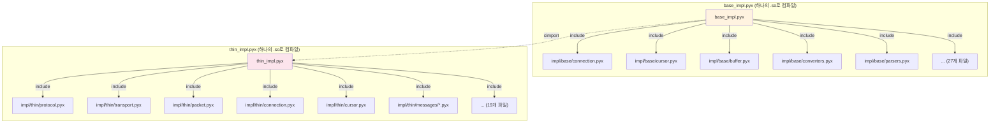

> **핵심 포인트**: `impl/thin/connection.pyx`는 독립 파일이 아니라 `thin_impl.pyx` 안에 포함(embed)됩니다.  
> IDE에서 단독으로 열면 심볼 해석이 안 될 수 있습니다.

---

## 4. 핵심 클래스 다이어그램

### 4.1 Connection 계층

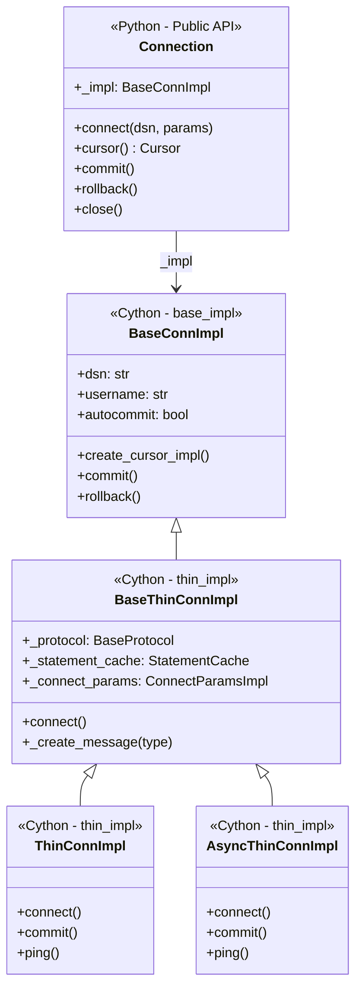

### 4.2 Cursor 계층

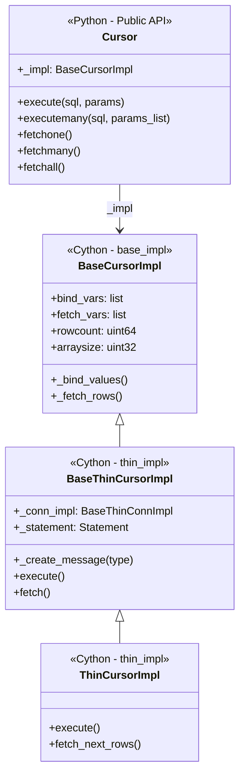

### 4.3 네트워크 계층

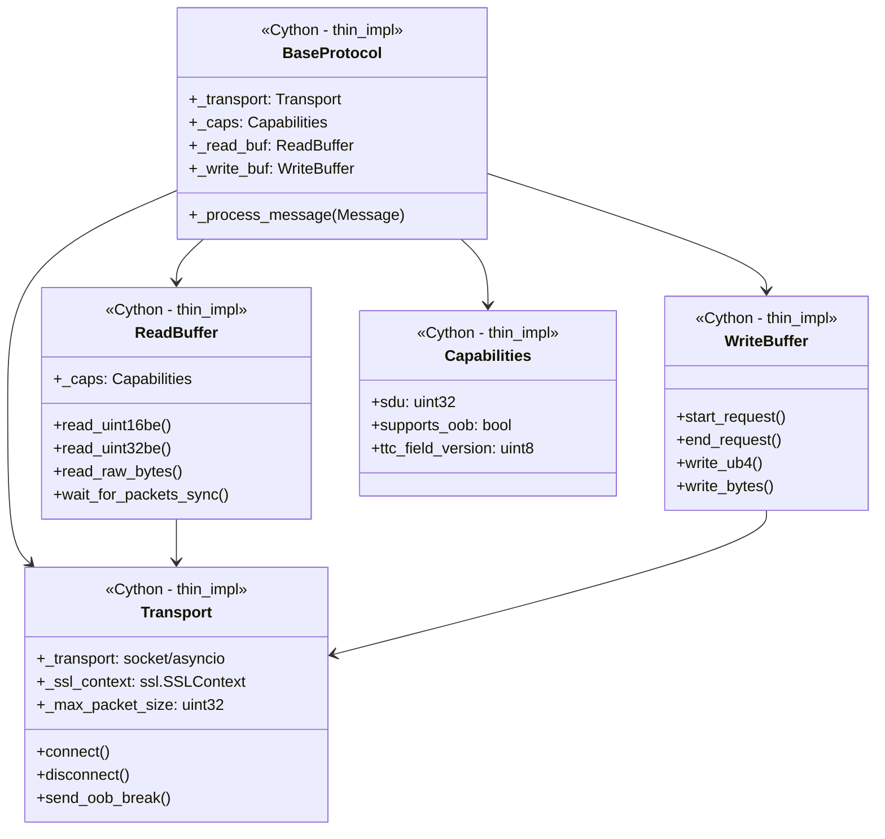

### 4.4 메시지 시스템

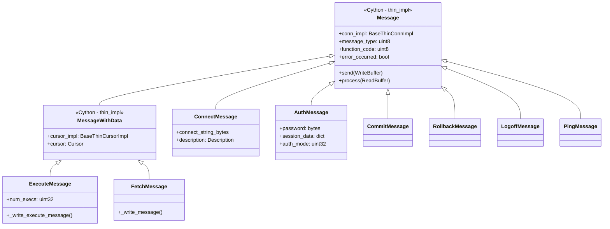

---

## 5. 연결(Connection) 워크플로우

### 5.1 연결 수립 과정

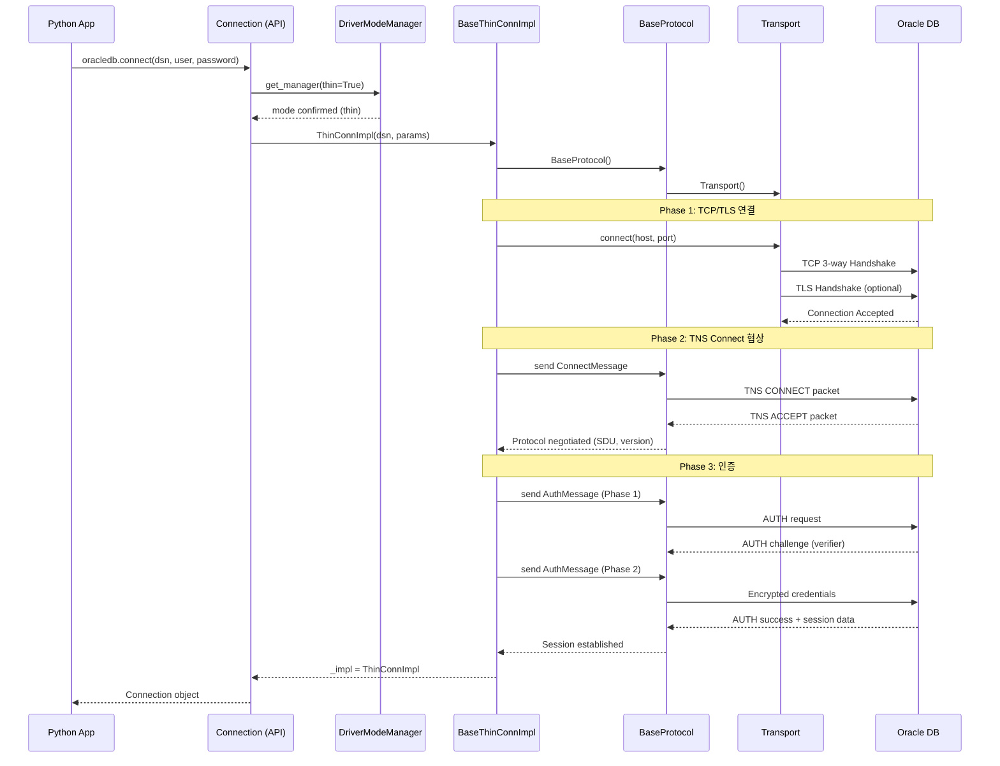

### 5.2 SQL 실행 워크플로우

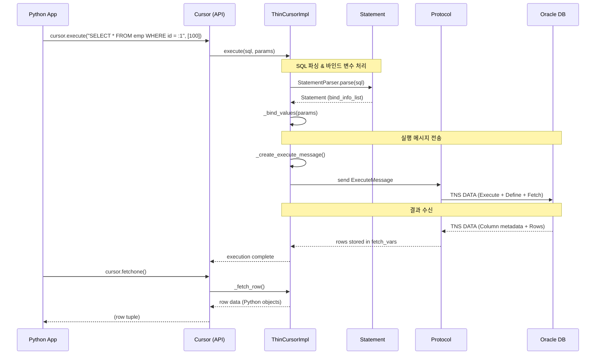

### 5.3 Connection Pool 워크플로우

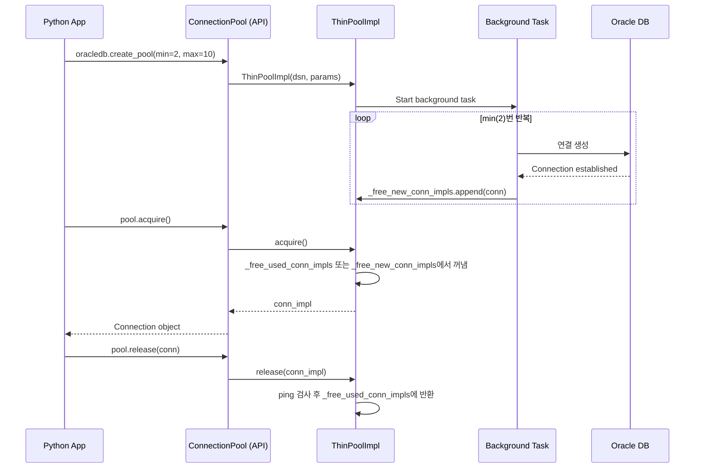

---

## 6. 패킷 구조 (TNS Protocol)

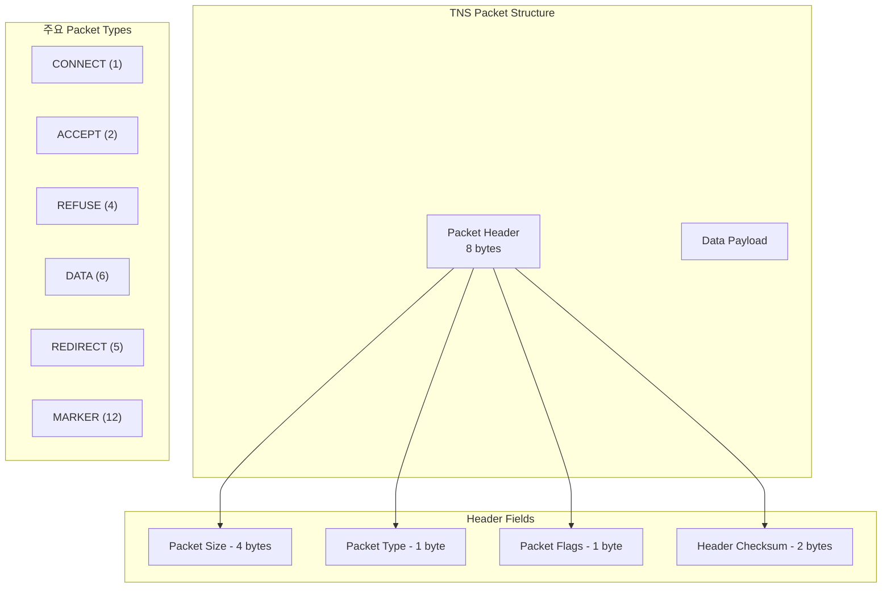

### Data Packet 내부 구조

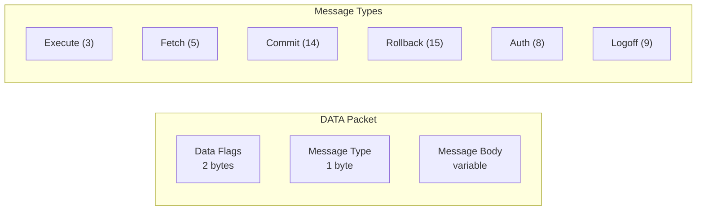

---

## 7. 디렉토리 구조 요약

```
src/oracledb/
├── __init__.py              # 패키지 진입점 (public exports)
├── connection.py            # Connection 클래스 (Public API)
├── cursor.py                # Cursor 클래스 (Public API)
├── pool.py                  # ConnectionPool 클래스 (Public API)
├── connect_params.py        # 연결 파라미터 (Public API)
├── driver_mode.py           # Thin/Thick 모드 관리
├── base.py                  # BaseMetaClass
├── errors.py                # 에러 코드 정의
├── exceptions.py            # Exception 클래스
│
├── base_impl.pyx            # ★ Base 구현 (Cython 엔트리포인트)
├── thin_impl.pyx            # ★ Thin 구현 (Cython 엔트리포인트)
│
├── impl/
│   ├── base/                # Base 구현 모듈들
│   │   ├── connection.pyx   #   BaseConnImpl
│   │   ├── cursor.pyx       #   BaseCursorImpl
│   │   ├── buffer.pyx       #   Buffer, GrowableBuffer
│   │   ├── converters.pyx   #   데이터 타입 변환
│   │   ├── parsers.pyx      #   SQL 파서
│   │   ├── connect_params.pyx  # ConnectParamsImpl
│   │   └── ...
│   │
│   └── thin/                # Thin 구현 모듈들
│       ├── connection.pyx   #   BaseThinConnImpl, ThinConnImpl
│       ├── cursor.pyx       #   BaseThinCursorImpl, ThinCursorImpl
│       ├── protocol.pyx     #   BaseProtocol (요청/응답 관리)
│       ├── transport.pyx    #   Transport (소켓 I/O)
│       ├── packet.pyx       #   Packet, ReadBuffer, WriteBuffer
│       ├── pool.pyx         #   BaseThinPoolImpl, ThinPoolImpl
│       ├── statement.pyx    #   Statement, BindInfo
│       ├── statement_cache.pyx  # StatementCache
│       ├── capabilities.pyx #   Capabilities (서버 기능 협상)
│       ├── crypto.pyx       #   암호화 유틸리티
│       └── messages/        #   ★ TNS 메시지 정의
│           ├── base.pyx     #     Message, MessageWithData 기본 클래스
│           ├── connect.pyx  #     ConnectMessage
│           ├── auth.pyx     #     AuthMessage (인증)
│           ├── execute.pyx  #     ExecuteMessage (SQL 실행)
│           ├── fetch.pyx    #     FetchMessage (데이터 조회)
│           ├── commit.pyx   #     CommitMessage
│           ├── rollback.pyx #     RollbackMessage
│           └── ...          #     (26개 메시지 타입)
```

---

## 8. 핵심 설계 패턴

### 8.1 Impl 패턴 (Bridge Pattern)

Public API 클래스는 구현을 `_impl` 속성에 위임합니다. 이를 통해 Thin/Thick 모드를 런타임에 선택할 수 있습니다.

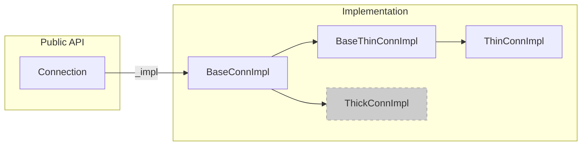

### 8.2 Message 패턴 (Command Pattern)

모든 데이터베이스 요청은 `Message` 객체로 캡슐화됩니다.

```python
# 의사 코드 (개념 설명용)
message = conn_impl._create_message(ExecuteMessage)
message.send(write_buf)      # 요청 직렬화 → 네트워크 전송
message.process(read_buf)    # 응답 수신 → 역직렬화
```

### 8.3 Statement Cache

동일 SQL을 반복 실행 시 파싱 비용을 절약합니다.

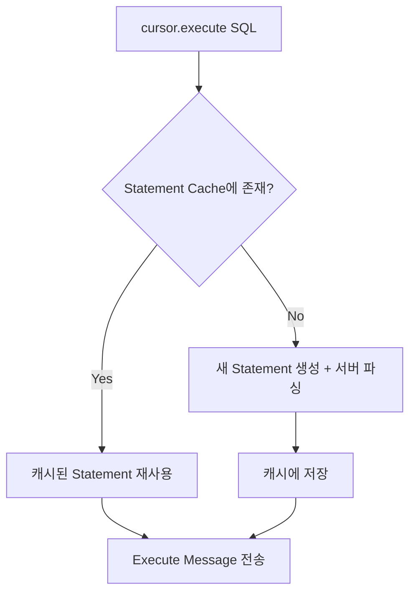

---

## 9. 데이터 타입 변환 흐름

> **상세 문서**: 소스 코드 레벨의 IN/OUT bind 변환 전체 분석은 [DATA_TYPE_CONVERSION.md](DATA_TYPE_CONVERSION.md)를 참조하세요.

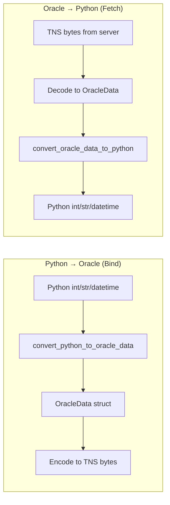

---

## 10. 개발 환경 관련

### 빌드 명령

```bash
# Cython 확장 빌드
python setup.py build_ext --inplace

# 디버그 빌드 (cygdb 디버깅용)
rm -rf cython_debug
python -m cython --gdb src/oracledb/base_impl.pyx
python -m cython --gdb src/oracledb/thin_impl.pyx
PYO_COMPILE_ARGS="-O0 -g3" python setup.py build_ext --inplace --force
```

### 주요 환경변수

| 변수 | 용도 |
|------|------|
| `PYO_DEBUG_PACKETS` | TNS 패킷 디버그 출력 |
| `PYO_SAMPLES_DRIVER_MODE` | 샘플 실행 모드 (`thin`/`thick`) |

---

## 11. 요약 다이어그램 (전체 흐름)

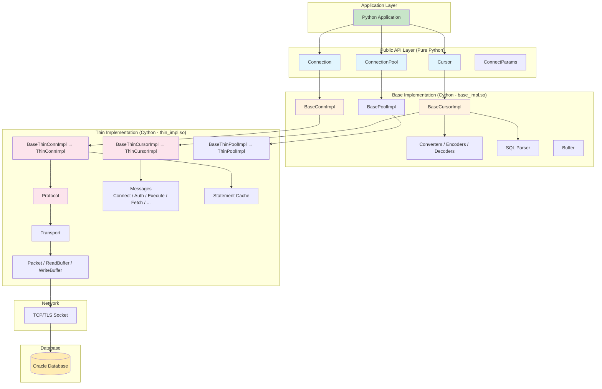

---

## 12. 다음 단계

1. `samples/` 디렉토리의 예제를 실행하여 드라이버 동작을 체험
2. `impl/thin/messages/execute.pyx`를 읽으며 SQL 실행의 직렬화 과정 이해
3. `impl/thin/protocol.pyx`에서 요청/응답 라이프사이클 추적
4. `impl/base/converters.pyx`에서 Oracle↔Python 타입 매핑 학습
