# python-oracledb 데이터 타입 변환 상세 가이드

> **대상 독자**: Cython 코어를 Rust로 포팅해야 하는 개발자  
> **범위**: IN Bind (Python → Oracle Wire Format), OUT Bind / Fetch (Wire Format → Python)  
> **핵심 파일**: `impl/base/converters.pyx`, `impl/base/encoders.pyx`, `impl/base/decoders.pyx`, `impl/base/buffer.pyx`

---

## 1. 핵심 데이터 구조 (Rust 포팅 시 1:1 매핑 대상)

### 1.1 OracleData — 모든 변환의 중간 표현 (IR)

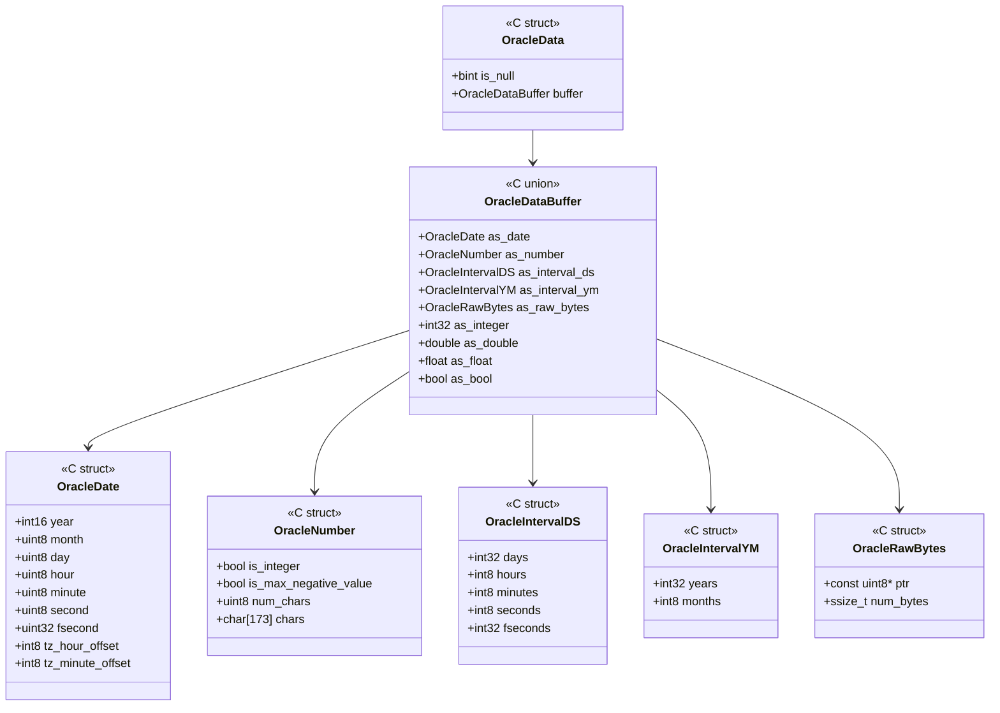

**Rust 매핑 제안**:
```rust
// Rust equivalent
enum OracleDataBuffer {
    Date(OracleDate),
    Number(OracleNumber),
    IntervalDS(OracleIntervalDS),
    IntervalYM(OracleIntervalYM),
    RawBytes { ptr: *const u8, len: usize },
    Integer(i32),
    Double(f64),
    Float(f32),
    Bool(bool),
}

struct OracleData {
    is_null: bool,
    buffer: OracleDataBuffer,
}
```

> **주의**: C에서는 `union`이므로 동시에 하나의 필드만 유효합니다. Rust에서는 `enum`으로 표현하는 것이 자연스럽습니다.

### 1.2 OracleMetadata — 타입 라우팅 정보

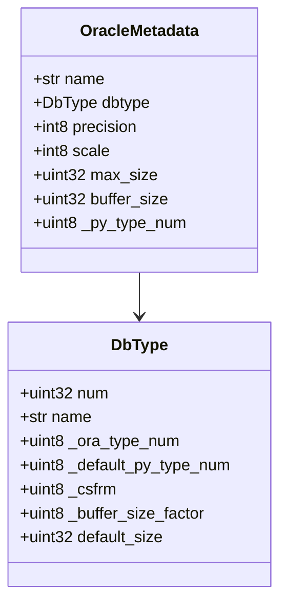

`_ora_type_num`과 `_py_type_num`이 변환 경로를 결정하는 **라우팅 키**입니다.

---

## 2. IN Bind 전체 흐름 (Python → Wire)

### 2.1 End-to-End 시퀀스

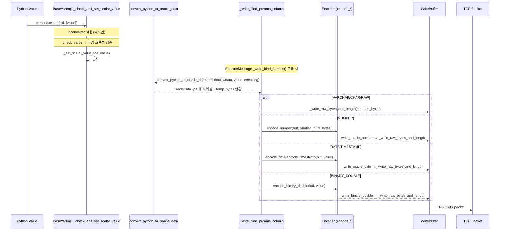

### 2.2 `convert_python_to_oracle_data` 라우팅 로직

소스: `impl/base/converters.pyx:675`

```python
# 의사 코드 (실제 Cython → 알고리즘 설명)
def convert_python_to_oracle_data(metadata, data, value, encoding):
    ora_type_num = metadata.dbtype._ora_type_num
    data.is_null = (value is None)

    if ora_type_num in (VARCHAR, CHAR, LONG):
        # str → bytes (UTF-8 또는 UTF-16 인코딩)
        temp_bytes = value.encode(encoding)  # encoding은 None이면 UTF-8
        data.buffer.as_raw_bytes = (ptr, len)
        return temp_bytes  # 수명 유지용

    elif ora_type_num in (RAW, LONG_RAW):
        # bytes 그대로 포인터 설정
        data.buffer.as_raw_bytes = (ptr, len)

    elif ora_type_num in (NUMBER, BINARY_INTEGER):
        # Python 값 → str 변환 → bytes 반환
        # bool은 '1'/'0', 나머지는 str(value).encode()
        if isinstance(value, bool):
            return b'1' if value else b'0'
        return str(value).encode()

    elif ora_type_num == BINARY_FLOAT:
        data.buffer.as_float = float(value)

    elif ora_type_num == BINARY_DOUBLE:
        data.buffer.as_double = float(value)

    elif ora_type_num == BOOLEAN:
        data.buffer.as_bool = bool(value)

    return value
```

**핵심 포인트**:
- NUMBER 타입은 `OracleData`에 저장하지 않고 **bytes를 반환**합니다. 이 bytes가 이후 `encode_number()`의 입력이 됩니다.
- VARCHAR/CHAR는 인코딩된 bytes의 포인터를 `OracleRawBytes`에 설정하므로, **반환된 temp_bytes의 수명이 wire write 전까지 유지**되어야 합니다 (Rust에서는 lifetime 관리 필수).

### 2.3 Encoder 상세: `encode_number` (Oracle NUMBER Wire Format)

소스: `impl/base/encoders.pyx:163`

Oracle NUMBER는 가변 길이 BCD-like 인코딩입니다:

```
[exponent_byte] [mantissa_byte_1] [mantissa_byte_2] ... [sentinel?]
```

**알고리즘 (Rust 포팅 시 반드시 보존해야 할 로직)**:

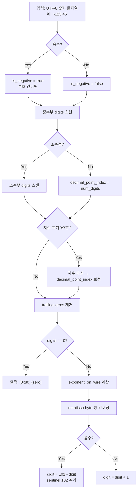

**Wire 바이트 레이아웃**:

| Offset | 크기 | 설명 |
|--------|------|------|
| 0 | 1 byte | Exponent. 양수: `(decimal_point_index/2) + 192`, 음수: bitwise NOT |
| 1..N | N bytes | Mantissa. 각 바이트는 base-100 digit pair. 양수: `pair+1`, 음수: `101-pair` |
| N+1 | 0-1 byte | Sentinel. 음수이고 digit 수 < 20이면 `102` 추가 |

**예시: `123.45`**
- digits: `[1,2,3,4,5]` → decimal_point_index = 3
- exponent_on_wire: `(3/2) + 192 = 193` → `0xC1`
- 짝수로 맞춤: `[1,2,3,4,5,0]` → 3 pairs: (12, 34, 50)
- mantissa: `[13, 35, 51]`
- 결과: `[0xC1, 0x0D, 0x23, 0x33]` (4 bytes)

### 2.4 Encoder 상세: `encode_date` (Oracle DATE Wire Format)

소스: `impl/base/encoders.pyx:113`

```
Byte layout (7 bytes for DATE, 11 for TIMESTAMP, 13 for TIMESTAMP WITH TZ):
[0] century = year/100 + 100
[1] year_in_century = year%100 + 100
[2] month (1-12)
[3] day (1-31)
[4] hour + 1 (1-24)
[5] minute + 1 (1-61)
[6] second + 1 (1-61)
[7-10] fractional seconds as uint32 BE (TIMESTAMP only)
[11] tz_hour_offset (TIMESTAMP WITH TZ only)
[12] tz_minute_offset (TIMESTAMP WITH TZ only)
```

**Rust 구현 주의사항**:
- hour/minute/second에 +1 오프셋 (0 값을 NULL과 구분하기 위한 Oracle 관례)
- fractional seconds는 **nanoseconds** (Python microseconds × 1000)
- `write_oracle_date`에서 fsecond==0이면 length를 7로 줄여 DATE로 전송 (최적화)

### 2.5 Encoder 상세: `encode_binary_double` (IEEE 754 변형)

소스: `impl/base/encoders.pyx:33`

Oracle의 BINARY_DOUBLE은 **IEEE 754 big-endian + sign bit flip**:

```
if MSB & 0x80 == 0 (양수):
    MSB |= 0x80       # sign bit를 세팅
else (음수):
    모든 바이트 bitwise NOT
```

이 변환은 **memcmp으로 올바른 정렬 순서를 보장**하기 위한 것입니다.

### 2.6 `_write_bind_params_column` 분기 테이블

소스: `impl/thin/messages/base.pyx:1401`

| `ora_type_num` | 변환 경로 | Wire Writer |
|----------------|-----------|-------------|
| VARCHAR, CHAR, LONG, RAW, LONG_RAW | `convert_python_to_oracle_data` → raw bytes | `_write_raw_bytes_and_length` |
| NUMBER, BINARY_INTEGER | `convert_python_to_oracle_data` → str bytes → `encode_number` | `write_oracle_number` |
| DATE, TIMESTAMP, TIMESTAMP_TZ, TIMESTAMP_LTZ | 값을 직접 `encode_date/timestamp` | `write_oracle_date` |
| BINARY_DOUBLE | `data.buffer.as_double` → `encode_binary_double` | `write_binary_double` |
| BINARY_FLOAT | `data.buffer.as_float` → `encode_binary_float` | `write_binary_float` |
| BOOLEAN | `data.buffer.as_bool` → `encode_boolean` | `write_bool` |
| INTERVAL_DS | 값 직접 → `encode_interval_ds` | `write_interval_ds` |
| INTERVAL_YM | 값 직접 → `encode_interval_ym` | `write_interval_ym` |
| CLOB, BLOB | LOB locator 직렬화 | `write_lob_with_length` |
| CURSOR | cursor_id 직렬화 | write_ub4 |
| JSON | OSON 인코딩 | `write_oson` |
| VECTOR | 전용 벡터 인코딩 | `write_vector` |
| OBJECT | DbObject 직렬화 | `write_dbobject` |

---

## 3. OUT Bind / Fetch 전체 흐름 (Wire → Python)

### 3.1 End-to-End 시퀀스

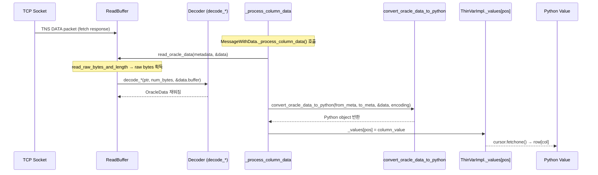

### 3.2 `read_oracle_data` — Wire → OracleData

소스: `impl/base/buffer.pyx:165`

```python
# 의사 코드
def read_oracle_data(metadata, data, from_dbobject, decode_str):
    ptr, num_bytes = read_raw_bytes_and_length()  # 길이 prefixed bytes 읽기
    data.is_null = (ptr is NULL)

    if not data.is_null:
        ora_type_num = metadata.dbtype._ora_type_num

        match ora_type_num:
            BINARY_DOUBLE → decode_binary_double(ptr, num_bytes, &data.buffer)
            BINARY_FLOAT  → decode_binary_float(ptr, num_bytes, &data.buffer)
            BOOLEAN       → data.buffer.as_bool = ptr[0] == 1  (또는 ptr[last] for dbobject)
            CHAR/VARCHAR/RAW/LONG → data.buffer.as_raw_bytes = {ptr, num_bytes}
            DATE/TIMESTAMP → decode_date(ptr, num_bytes, &data.buffer)
            INTERVAL_DS   → decode_interval_ds(ptr, num_bytes, &data.buffer)
            INTERVAL_YM   → decode_interval_ym(ptr, num_bytes, &data.buffer)
            NUMBER        → decode_number(ptr, num_bytes, &data.buffer)
```

### 3.3 Decoder 상세: `decode_number` (Wire → OracleNumber chars)

소스: `impl/base/decoders.pyx:159`

이 함수는 Oracle wire format NUMBER를 **문자열 표현** (예: `"-123.45\0"`)으로 디코딩합니다.

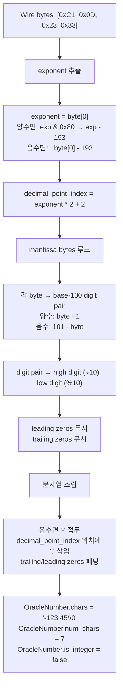

**중요**: `OracleNumber.chars`는 null-terminated UTF-8 문자열입니다. 이후 `strtoll()`, `strtod()` 등 C 표준 함수로 변환 가능합니다.

### 3.4 Decoder 상세: `decode_date`

소스: `impl/base/decoders.pyx:101`

```
Wire bytes → OracleDate 구조체:
year   = (ptr[0] - 100) * 100 + ptr[1] - 100
month  = ptr[2]
day    = ptr[3]
hour   = ptr[4] - 1
minute = ptr[5] - 1
second = ptr[6] - 1
fsecond = decode_uint32be(ptr[7..11]) / 1000  (나노초→마이크로초)
tz_hour = ptr[11] - TZ_HOUR_OFFSET  (TIMESTAMP WITH TZ만)
tz_min  = ptr[12] - TZ_MINUTE_OFFSET
```

### 3.5 Decoder 상세: `decode_binary_double`

소스: `impl/base/decoders.pyx:33`

`encode`의 역연산:
```
if MSB & 0x80 (양수였음):
    MSB &= 0x7F     # sign bit 복원
else (음수였음):
    모든 바이트 bitwise NOT
→ IEEE 754 double로 memcpy
```

### 3.6 `convert_oracle_data_to_python` — OracleData → Python

소스: `impl/base/converters.pyx:503`

이 함수는 `(from_metadata.ora_type_num, to_metadata._py_type_num)` 쌍으로 변환 경로를 결정합니다.

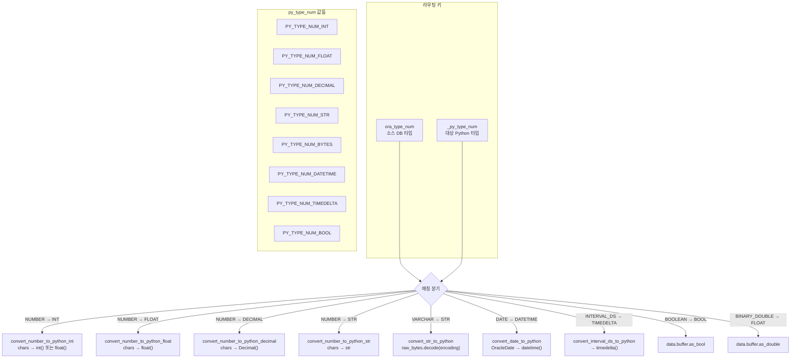

### 3.7 NUMBER → Python 변환 분기 상세

| `_py_type_num` | 호출 함수 | 동작 |
|----------------|-----------|------|
| `PY_TYPE_NUM_INT` | `convert_number_to_python_int` | `is_integer`이면 `int(chars)`, 아니면 `float(chars)` |
| `PY_TYPE_NUM_FLOAT` | `convert_number_to_python_float` | `float(chars)` |
| `PY_TYPE_NUM_DECIMAL` | `convert_number_to_python_decimal` | `Decimal(chars.decode())` |
| `PY_TYPE_NUM_STR` | `convert_number_to_python_str` | `chars.decode()` 그대로 |

**`is_max_negative_value` 특수 케이스**: Oracle NUMBER 최소값 `-1e126`은 mantissa가 비어있고 exponent가 음수인 경우입니다. 별도 처리 필요.

---

## 4. 특수 케이스 처리

### 4.1 NCHAR (UTF-16) 인코딩

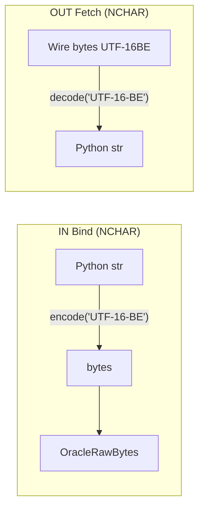

`csfrm == CS_FORM_NCHAR`일 때 인코딩이 UTF-16BE로 전환됩니다.

### 4.2 LOB 처리

LOB는 `convert_python_to_oracle_data`를 거치지 않습니다:
1. IN Bind: Python 값이 `str`/`bytes`면 → 임시 LOB 생성 (`conn.createlob()`) → locator 직렬화
2. OUT Fetch: `read_lob_with_length()` → LOB locator를 `BaseThinLobImpl`으로 래핑

### 4.3 NULL 처리

| 방향 | NULL 표현 |
|------|-----------|
| IN Bind | `data.is_null = True` → wire에 `0x00` (1 byte) 기록 |
| OUT Fetch | `read_raw_bytes_and_length`에서 length==0 또는 `TNS_NULL_LENGTH_INDICATOR` → `ptr = NULL` |
| VARCHAR 빈 문자열 | Oracle에서 빈 문자열 = NULL. `num_bytes == 0`이면 `data.is_null = True` 처리 |

### 4.4 BOOLEAN

Oracle 23c+에서 지원. Wire 형태가 두 가지:
- **일반 컨텍스트**: `0x00` = false, `0x0101` = true
- **DbObject 내부**: big-endian uint32 (`0` or `1`)

---

## 5. 복합/특수 타입 처리 (OBJECT, VECTOR, JSON)

이 타입들은 `convert_python_to_oracle_data` / `convert_oracle_data_to_python`을 **거치지 않는 별도 경로**로 처리됩니다.

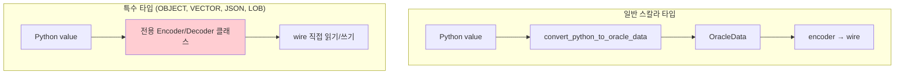

### 5.1 처리 분기점 (`_process_column_data` / `_write_bind_params_column`)

소스: `impl/thin/messages/base.pyx`

**Fetch (OUT) 분기 순서**:
```python
# 의사 코드 - _process_column_data 내부
match ora_type_num:
    ROWID / UROWID       → 전용 rowid 파싱
    CURSOR               → 중첩 커서 생성 (cursor_id 읽기)
    CLOB / BLOB / BFILE  → read_lob_with_length()
    JSON                 → read_oson()
    VECTOR               → read_vector()
    OBJECT:
        if objtype is None → read_xmltype()   # XMLType
        else               → read_dbobject()  # UDT / VARRAY / Nested Table
    _                    → read_oracle_data() + convert_oracle_data_to_python()
                           # ↑ 일반 스칼라 타입만 여기 도달
```

**Bind (IN) 분기 순서**:
```python
# 의사 코드 - _write_bind_params_column 내부
match ora_type_num:
    VARCHAR/CHAR/RAW/... → convert_python_to_oracle_data → raw write
    NUMBER               → convert_python_to_oracle_data → write_oracle_number
    DATE/TIMESTAMP       → write_oracle_date
    BINARY_DOUBLE/FLOAT  → write_binary_double / float
    BOOLEAN              → write_bool
    INTERVAL_DS/YM       → write_interval_ds / ym
    CURSOR               → write cursor_id
    CLOB / BLOB          → write_lob_with_length(locator)
    ROWID / UROWID       → write_bytes_with_length
    OBJECT               → write_dbobject(obj_impl)
    JSON                 → write_oson(value)
    VECTOR               → write_vector(value)
```

### 5.2 OBJECT (UDT, VARRAY, Nested Table, Associative Array)

소스: `impl/thin/dbobject.pyx`, `impl/thin/packet.pyx:429,841`

#### Wire 전송 형태

| 방향 | 함수 | 설명 |
|------|------|------|
| **Fetch** | `ReadBuffer.read_dbobject(typ_impl)` | packed_data를 `ThinDbObjectImpl`에 lazy 저장 |
| **Bind** | `WriteBuffer.write_dbobject(obj_impl)` | `_get_packed_data()` → 직렬화 |

#### Wire Layout

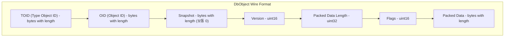

#### Pickle Format (packed_data 내부 구조)

DbObject의 packed_data는 Oracle 자체의 "Pickle" 포맷입니다. `DbObjectPickleBuffer` 클래스가 이를 처리합니다.

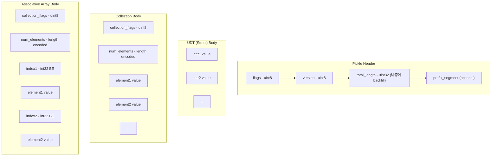

#### 값 인코딩/디코딩 (`_pack_value` / `_unpack_value`)

각 속성/요소의 값은 `ora_type_num`에 따라 **재귀적으로** 인코딩됩니다:

| `ora_type_num` | Pack (Bind) | Unpack (Fetch) |
|----------------|-------------|----------------|
| VARCHAR, CHAR | `buf.write_bytes_with_length(str.encode(encoding))` | `buf.read_oracle_data()` → `convert_oracle_data_to_python(from_dbobject=True)` |
| NUMBER | `buf.write_oracle_number(str(value).encode())` | 동일 |
| BINARY_INTEGER | `buf.write_uint8(4); buf.write_uint32be(value)` | `decode_integer(ptr, 4)` → `data.buffer.as_integer` |
| RAW | `buf.write_bytes_with_length(value)` | 동일 |
| BINARY_DOUBLE | `buf.write_binary_double(value)` | 동일 |
| BINARY_FLOAT | `buf.write_binary_float(value)` | 동일 |
| BOOLEAN | `buf.write_uint8(4); buf.write_uint32be(value)` | `ptr[last] == 1` |
| DATE/TIMESTAMP | `buf.write_oracle_date(value, size)` | 동일 |
| LOB (CLOB/BLOB) | `buf.write_bytes_with_length(locator)` | locator → `BaseThinLobImpl` |
| OBJECT (중첩) | `_get_packed_data()` or 재귀 `_pack_data(buf)` | 재귀 `_unpack_data_from_buf(buf)` |
| NULL | struct: `TNS_OBJ_ATOMIC_NULL(0xFD)`, collection: `TNS_NULL_LENGTH_INDICATOR(0xFF)` | `get_is_atomic_null()` 검사 |

**핵심 차이**: DbObject 내부의 BOOLEAN과 BINARY_INTEGER는 일반 컨텍스트와 **다른 wire 표현**을 사용합니다 (uint32 big-endian).

#### Lazy Unpack 패턴

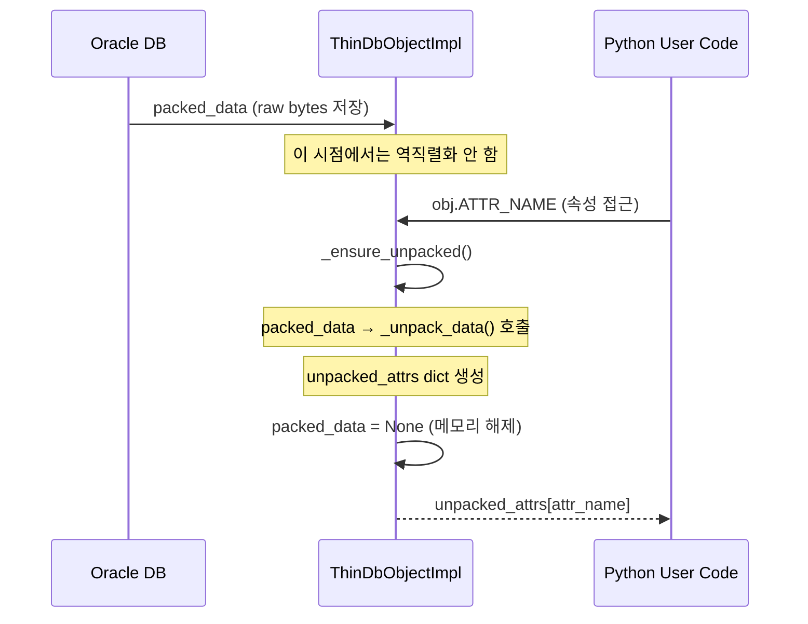

#### Type Cache (`dbobject_cache.pyx`)

UDT 구조(속성 목록, 타입 정보)는 서버에서 `DBMS_PICKLER.GET_TYPE_SHAPE`를 호출하여 가져오고 캐시됩니다. 연결 당 하나의 타입 캐시를 유지합니다.

### 5.3 VECTOR

소스: `impl/base/vector.pyx`, `impl/thin/packet.pyx:596,913`

#### Wire 전송 형태

VECTOR는 LOB처럼 QLocator 래퍼에 감싸서 전송됩니다:

| 방향 | 함수 | 설명 |
|------|------|------|
| **Fetch** | `ReadBuffer.read_vector()` | QLocator 스킵 → `VectorDecoder.decode(data)` → `array.array` |
| **Bind** | `WriteBuffer.write_vector(value)` | `VectorEncoder.encode(value)` → QLocator + bytes |

#### Wire Layout

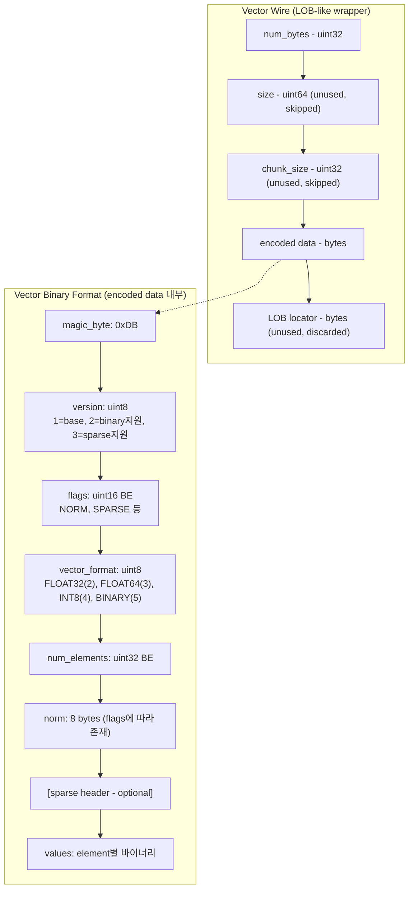

#### Vector Format별 요소 인코딩

| Format | 코드 | 요소 크기 | 인코딩 방식 | Python 타입 |
|--------|------|-----------|-------------|-------------|
| FLOAT32 | 2 | 4 bytes | `encode_binary_float` (Oracle sign flip) | `array.array('f')` |
| FLOAT64 | 3 | 8 bytes | `encode_binary_double` (Oracle sign flip) | `array.array('d')` |
| INT8 | 4 | 1 byte | 직접 복사 (signed) | `array.array('b')` |
| BINARY | 5 | 1 bit/element | 8개 요소 = 1 byte (packed bits) | `array.array('B')` |

**FLOAT32/FLOAT64**: 개별 요소에 `encode_binary_float`/`encode_binary_double`을 적용합니다 (일반 BINARY_FLOAT/DOUBLE과 동일한 Oracle sign-flip 인코딩).

#### Sparse Vector

```
[sparse header]:
  num_sparse_elements: uint16
  indices[]: uint32 BE × num_sparse_elements
  values[]: element × num_sparse_elements

Python 타입: oracledb.SparseVector (num_dimensions, indices, values)
```

### 5.4 JSON (OSON)

소스: `impl/base/oson.pyx`, `impl/thin/packet.pyx:461,899`

#### Wire 전송 형태

JSON도 VECTOR와 마찬가지로 LOB-like 래퍼(QLocator)에 감싸서 전송됩니다:

| 방향 | 함수 | 설명 |
|------|------|------|
| **Fetch** | `ReadBuffer.read_oson()` | LOB 메타 스킵 → `OsonDecoder.decode(data)` → Python dict/list |
| **Bind** | `WriteBuffer.write_oson(value)` | `OsonEncoder.encode(value)` → QLocator + OSON bytes |

#### QLocator 구조 (VECTOR/JSON 공통 래퍼)

```
QLocator (40 bytes 고정):
  [length: uint32 = 40]
  [chunk_length: uint8 = 40]
  [qlocator_length: uint16 BE = 38]
  [version: uint16 BE]
  [flags: uint8] - VALUE_BASED | BLOB | ABSTRACT
  [loc_flags: uint8] - INIT
  [additional_flags: uint16 BE = 0]
  [byt1: uint16 BE = 1]
  [data_length: uint64 BE]
  [unused: remaining bytes = 0]
```

이후 실제 데이터가 `_write_raw_bytes_and_length`로 기록됩니다.

OSON(Oracle Binary JSON)은 별도의 바이너리 포맷이며, `impl/base/oson.pyx`의 `OsonEncoder`/`OsonDecoder`에서 처리합니다. 상세 구조는 이 문서의 범위를 벗어나지만, 핵심은 **key 해시 테이블 + 재귀적 값 인코딩**입니다.

### 5.5 특수 타입 요약 비교

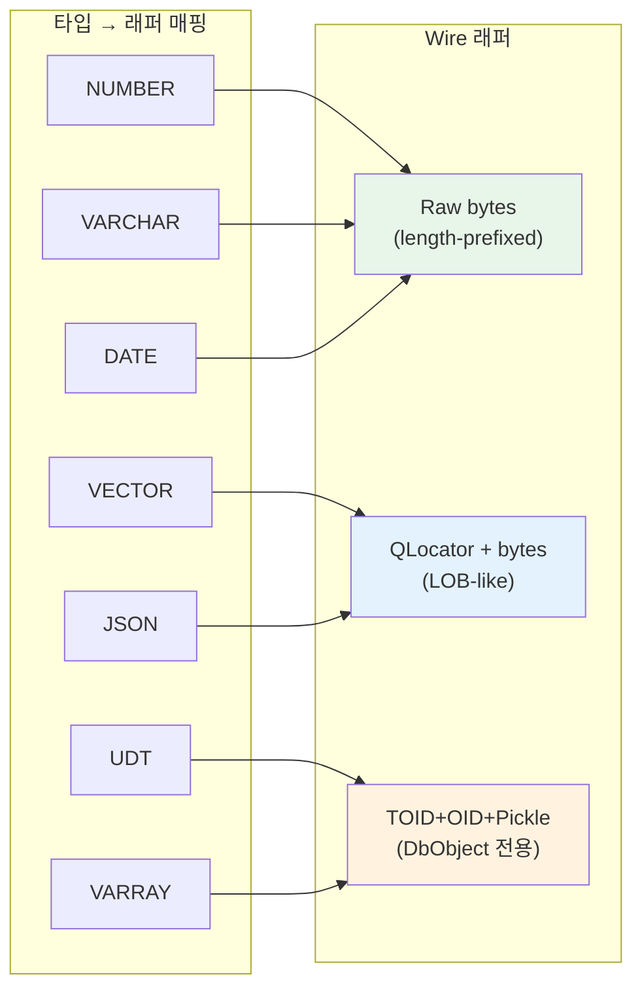

| 특수 타입 | Wire 래퍼 | Encoder 클래스 | Decoder 클래스 | Python 결과 타입 |
|-----------|-----------|---------------|---------------|-----------------|
| OBJECT (UDT) | TOID+OID+Pickle | `DbObjectPickleBuffer._pack_data` | `DbObjectPickleBuffer._unpack_data` | `oracledb.DbObject` |
| VARRAY/Nested Table | TOID+OID+Pickle (is_collection=True) | 동일 | 동일 | `oracledb.DbObject` (list-like) |
| Associative Array | TOID+OID+Pickle (index_table) | 동일 | 동일 | `oracledb.DbObject` (dict-like) |
| VECTOR | QLocator + binary | `VectorEncoder` | `VectorDecoder` | `array.array` / `SparseVector` |
| JSON | QLocator + OSON | `OsonEncoder` | `OsonDecoder` | `dict` / `list` / scalar |
| XMLType | TOID+OID+Pickle (special) | — | `DbObjectPickleBuffer.read_xmltype` | `str` (XML text) |

### 5.6 Rust 포팅 시 고려사항

1. **DbObject Pickle Buffer**: `GrowableBuffer`를 상속한 `DbObjectPickleBuffer`는 자체 `read_raw_bytes_and_length` / `_write_raw_bytes_and_length`를 오버라이드합니다. Rust에서는 trait로 추상화 가능.

2. **재귀적 구조**: UDT 내에 중첩 UDT가 있을 수 있으므로 `_pack_value`/`_unpack_value`는 재귀 호출됩니다. Rust에서는 stack overflow 방지를 위해 depth limit 필요.

3. **Type Cache**: 서버에서 SQL로 타입 메타데이터를 가져와 캐시. 연결 생성 후 처음 해당 타입 사용 시 lazy 로드.

4. **QLocator 패턴**: VECTOR와 JSON은 동일한 QLocator 래퍼를 공유하므로, `write_qlocator()` / 읽기 로직을 공통 모듈로 추출 가능.

5. **BINARY_INTEGER in DbObject**: 일반 컨텍스트에서는 `encode_number`를 사용하지만, DbObject 내부에서는 **4 bytes big-endian uint32**로 고정 크기 인코딩. 컨텍스트에 따라 분기 필수.

---

## 6. Wire Format Length Encoding

`_write_raw_bytes_and_length` / `read_raw_bytes_and_length`의 길이 인코딩:

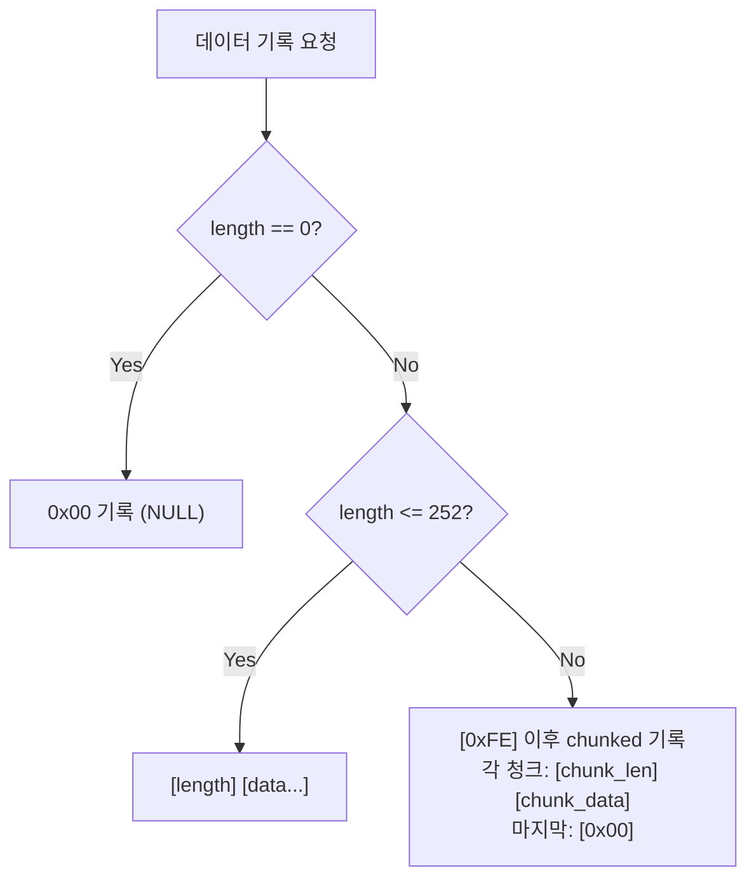

- 길이 1바이트: 0~252 범위의 짧은 데이터
- `0xFE` (TNS_LONG_LENGTH_INDICATOR): 이후 여러 청크로 분할 전송
- `0xFF` (TNS_NULL_LENGTH_INDICATOR): NULL 표시

---

## 7. 전체 타입 매핑 테이블

| Oracle Type | `ora_type_num` | Wire Size | Encoder | Decoder | Default Python Type |
|-------------|---------------|-----------|---------|---------|---------------------|
| VARCHAR2 | `ORA_TYPE_NUM_VARCHAR` | variable | raw copy | raw copy | `str` |
| CHAR | `ORA_TYPE_NUM_CHAR` | variable | raw copy | raw copy | `str` |
| NUMBER | `ORA_TYPE_NUM_NUMBER` | 1-22 bytes | `encode_number` | `decode_number` | `int`/`float` |
| BINARY_INTEGER | `ORA_TYPE_NUM_BINARY_INTEGER` | 1-22 bytes | `encode_number` | `decode_number` | `int` |
| BINARY_FLOAT | `ORA_TYPE_NUM_BINARY_FLOAT` | 4 bytes | `encode_binary_float` | `decode_binary_float` | `float` |
| BINARY_DOUBLE | `ORA_TYPE_NUM_BINARY_DOUBLE` | 8 bytes | `encode_binary_double` | `decode_binary_double` | `float` |
| DATE | `ORA_TYPE_NUM_DATE` | 7 bytes | `encode_date` | `decode_date` | `datetime` |
| TIMESTAMP | `ORA_TYPE_NUM_TIMESTAMP` | 11 bytes | `encode_timestamp` | `decode_date` | `datetime` |
| TIMESTAMP WITH TZ | `ORA_TYPE_NUM_TIMESTAMP_TZ` | 13 bytes | `encode_timestamp_tz` | `decode_date` | `datetime` |
| INTERVAL DAY TO SECOND | `ORA_TYPE_NUM_INTERVAL_DS` | 11 bytes | `encode_interval_ds` | `decode_interval_ds` | `timedelta` |
| INTERVAL YEAR TO MONTH | `ORA_TYPE_NUM_INTERVAL_YM` | 5 bytes | `encode_interval_ym` | `decode_interval_ym` | `IntervalYM` |
| BOOLEAN | `ORA_TYPE_NUM_BOOLEAN` | 1-2 bytes | `encode_boolean` | 직접 해석 | `bool` |
| RAW | `ORA_TYPE_NUM_RAW` | variable | raw copy | raw copy | `bytes` |
| CLOB/BLOB | `ORA_TYPE_NUM_CLOB/BLOB` | locator | LOB protocol | LOB protocol | `LOB` |
| JSON | `ORA_TYPE_NUM_JSON` | variable | OSON encode | OSON decode | `dict`/`list` |
| VECTOR | `ORA_TYPE_NUM_VECTOR` | variable | vector encode | vector decode | `array` |

---

## 8. Rust 포팅 시 핵심 고려사항

### 7.1 메모리 수명 (Lifetime)

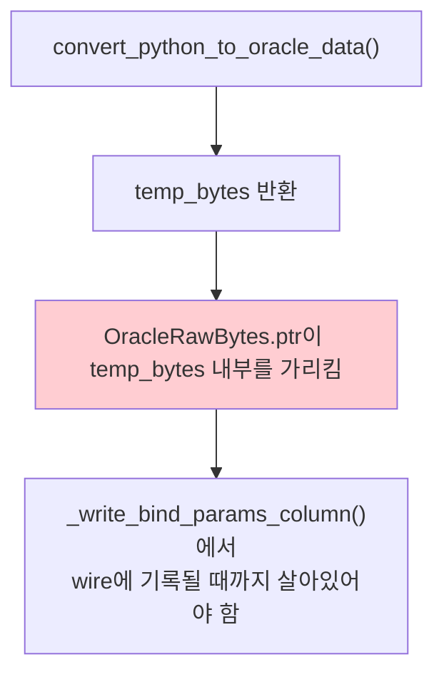

Cython에서는 Python GC가 `temp_bytes`를 유지합니다. Rust에서는:
- `Vec<u8>`을 반환하고 caller가 소유
- 또는 arena allocator 패턴 사용
- `OracleRawBytes`를 `&'a [u8]` lifetime으로 명시

### 7.2 Zero-Copy 경로

VARCHAR/RAW fetch는 **zero-copy**입니다:
- `read_raw_bytes_and_length`가 내부 버퍼의 포인터를 직접 반환
- 이 포인터가 `OracleRawBytes.ptr`에 설정됨
- `convert_str_to_python`에서 `ptr[:num_bytes].decode()`로 Python str 생성

Rust에서는 read buffer에서 slice를 빌려와서 (`&[u8]`) 변환하는 것이 동일 패턴입니다.

### 7.3 에러 경로

`encode_number`에서 발생 가능한 에러:
- `ERR_NUMBER_STRING_OF_ZERO_LENGTH`: 빈 문자열
- `ERR_NUMBER_STRING_TOO_LONG`: 173자 초과
- `ERR_INVALID_NUMBER`: 숫자가 아닌 문자
- `ERR_NUMBER_WITH_INVALID_EXPONENT`: 잘못된 지수
- `ERR_ORACLE_NUMBER_NO_REPR`: 범위 초과 (digits>40, exp>126, exp<-129)

### 7.4 성능 크리티컬 경로

fetch에서 가장 빈번한 호출 순서:
1. `read_raw_bytes_and_length` — 모든 컬럼마다 호출
2. `decode_number` — NUMBER 컬럼마다 호출 (가장 복잡)
3. `convert_number_to_python_int` — `int(chars)` 변환

Rust에서 `decode_number`의 chars 배열 조립은 SIMD 최적화 가능 영역입니다.

---

## 9. 파일-함수 매핑 (Quick Reference)

| 파일 | 핵심 함수 | 역할 |
|------|-----------|------|
| `impl/base/converters.pyx` | `convert_python_to_oracle_data` | Python → OracleData |
| `impl/base/converters.pyx` | `convert_oracle_data_to_python` | OracleData → Python |
| `impl/base/encoders.pyx` | `encode_number` | 텍스트 숫자 → Oracle NUMBER wire |
| `impl/base/encoders.pyx` | `encode_date` / `encode_timestamp` | datetime → wire |
| `impl/base/encoders.pyx` | `encode_binary_double` / `float` | IEEE754 → Oracle wire |
| `impl/base/encoders.pyx` | `encode_interval_ds` / `ym` | interval → wire |
| `impl/base/decoders.pyx` | `decode_number` | Oracle NUMBER wire → 텍스트 (chars) |
| `impl/base/decoders.pyx` | `decode_date` | wire → OracleDate 구조체 |
| `impl/base/decoders.pyx` | `decode_binary_double` / `float` | Oracle wire → IEEE754 |
| `impl/base/decoders.pyx` | `decode_interval_ds` / `ym` | wire → interval 구조체 |
| `impl/base/buffer.pyx` | `read_oracle_data` | wire bytes → decoder 라우팅 |
| `impl/base/buffer.pyx` | `write_oracle_number` / `date` / `...` | encoder → wire write |
| `impl/base/vector.pyx` | `VectorEncoder.encode` | Python array → VECTOR binary |
| `impl/base/vector.pyx` | `VectorDecoder.decode` | VECTOR binary → Python array |
| `impl/base/oson.pyx` | `OsonEncoder.encode` | Python dict/list → OSON binary |
| `impl/base/oson.pyx` | `OsonDecoder.decode` | OSON binary → Python dict/list |
| `impl/thin/dbobject.pyx` | `ThinDbObjectImpl._pack_data` | Python attrs → Pickle binary |
| `impl/thin/dbobject.pyx` | `ThinDbObjectImpl._unpack_data` | Pickle binary → Python attrs |
| `impl/thin/dbobject.pyx` | `DbObjectPickleBuffer` | Pickle 포맷 읽기/쓰기 버퍼 |
| `impl/thin/packet.pyx` | `read_dbobject` / `write_dbobject` | DbObject wire I/O |
| `impl/thin/packet.pyx` | `read_vector` / `write_vector` | VECTOR wire I/O (QLocator) |
| `impl/thin/packet.pyx` | `read_oson` / `write_oson` | JSON wire I/O (QLocator) |
| `impl/thin/messages/base.pyx` | `_write_bind_params_column` | IN bind 직렬화 디스패치 |
| `impl/thin/messages/base.pyx` | `_process_column_data` | OUT fetch 역직렬화 디스패치 |
