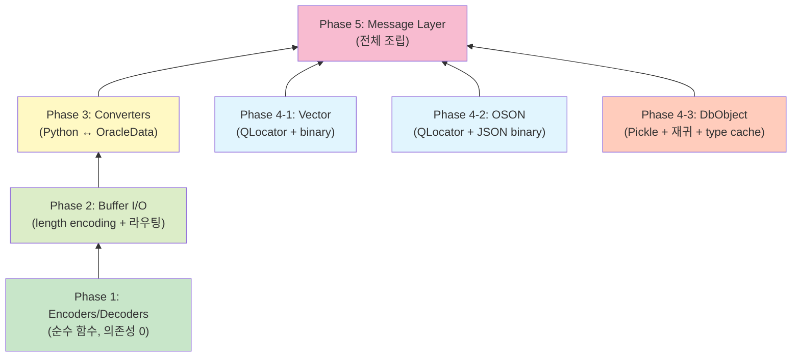

# Cython → Rust 점진적 마이그레이션 전략

> **대상 독자**: python-oracledb의 Cython 코어를 Rust로 포팅하는 개발자  
> **전제**: 기존 Python API는 유지하면서, 내부 구현만 Cython → Rust로 교체  
> **관련 문서**: [DATA_TYPE_CONVERSION.md](./DATA_TYPE_CONVERSION.md)

---

## Phase 0: FFI 브릿지 구축 (선행 작업)

```
Python ←→ PyO3 (Rust) ←→ 내부 Rust 모듈
```

PyO3로 Python extension module을 만들고, 기존 Cython `.so`와 **병렬 로드** 가능하게 세팅합니다. 하나의 함수 단위로 Rust 구현을 끼워넣을 수 있는 구조가 핵심입니다.

### 프로젝트 구조 예시

```
src/oracledb/
├── impl/
│   ├── base/           # 기존 Cython (점진적으로 제거)
│   └── thin/           # 기존 Cython
├── _rust_impl/         # 새 Rust extension (PyO3)
│   ├── src/
│   │   ├── lib.rs
│   │   ├── encoders.rs
│   │   ├── decoders.rs
│   │   ├── buffer.rs
│   │   ├── converters.rs
│   │   ├── vector.rs
│   │   ├── oson.rs
│   │   └── dbobject.rs
│   └── Cargo.toml
```

### Fallback 패턴

```python
# src/oracledb/impl/base/encoders.pyx (또는 Python wrapper)
try:
    from oracledb._rust_impl import encode_number as _encode_number
except ImportError:
    from oracledb._cython_impl import encode_number as _encode_number
```

이 패턴으로 Rust 모듈이 준비 안 된 경로는 기존 Cython으로 위임합니다.

---

## Phase 1: Encoder/Decoder (가장 독립적, 의존성 0)

**이유**: 순수 함수, 외부 상태 없음, 단위 테스트 용이

| 순서 | 모듈 | 난이도 | 비고 |
|------|------|--------|------|
| 1-1 | `encode_number` / `decode_number` | ★★★ | 가장 복잡, 일찍 검증해야 함 |
| 1-2 | `encode_date` / `decode_date` | ★☆☆ | 단순 byte 매핑 |
| 1-3 | `encode_binary_double/float` / `decode_*` | ★☆☆ | 8줄짜리 함수 |
| 1-4 | `encode_interval_ds/ym` / `decode_*` | ★☆☆ | 위와 동일 패턴 |

### 테스트 방법

```rust
// tests/test_encoders.rs — Rust 단위 테스트 (Cython 없이 독립 실행)

#[test]
fn test_encode_number_positive_integer() {
    let result = encode_number(b"123");
    assert_eq!(result, &[0xC1, 0x02, 0x18]);
}

#[test]
fn test_encode_number_negative_decimal() {
    let result = encode_number(b"-123.45");
    // 음수: exponent NOT, mantissa 101-digit, sentinel 102
    assert_eq!(result, &[0x3E, 0x59, 0x43, 0x33, 0x66]);
}

#[test]
fn test_encode_number_zero() {
    let result = encode_number(b"0");
    assert_eq!(result, &[0x80]);
}

#[test]
fn test_roundtrip_number() {
    let values = ["0", "1", "-1", "123.45", "-99.9", "1e20", "0.001"];
    for v in values {
        let encoded = encode_number(v.as_bytes());
        let decoded = decode_number(&encoded);
        assert_eq!(decoded.to_string(), v);
    }
}

#[test]
fn test_encode_date() {
    // 2024-03-15 10:30:45
    let date = OracleDate { year: 2024, month: 3, day: 15,
                            hour: 10, minute: 30, second: 45, fsecond: 0,
                            tz_hour_offset: 0, tz_minute_offset: 0 };
    let result = encode_date(&date);
    assert_eq!(result, &[120, 124, 3, 15, 11, 31, 46]); // +100 offsets
}

#[test]
fn test_encode_binary_double_positive() {
    let result = encode_binary_double(1.0f64);
    // IEEE754 BE + MSB set
    assert_eq!(result[0] & 0x80, 0x80);
}
```

### Python FFI 테스트

```python
# tests/test_rust_encoders.py
import pytest
from oracledb._rust_impl import encode_number, decode_number

@pytest.mark.parametrize("value", [
    "0", "1", "-1", "123.45", "-0.001", "9999999999999999999999999999999999999999",
    "1e125", "-1e-130",
])
def test_encode_decode_roundtrip(value):
    encoded = encode_number(value.encode())
    decoded = decode_number(encoded)
    # 문자열 비교 (trailing zeros 차이 허용)
    assert float(decoded) == float(value) or decoded == value
```

---

## Phase 2: Buffer I/O (`read_raw_bytes_and_length` / `write_*`)

**이유**: 모든 wire I/O의 기반. Phase 1의 encoder/decoder를 호출하는 라우터.

| 순서 | 모듈 | 비고 |
|------|------|------|
| 2-1 | Length encoding/decoding | `_write_raw_bytes_and_length` / `read_raw_bytes_and_length` |
| 2-2 | `ReadBuffer.read_oracle_data` | Phase 1의 decoder를 호출하는 라우터 |
| 2-3 | `WriteBuffer.write_oracle_number/date/...` | Phase 1의 encoder를 호출하는 라우터 |

### 테스트 방법: Wire Dump Fixture

실제 Oracle wire dump를 캡쳐하여 fixture로 사용합니다.

```rust
// tests/test_buffer.rs

#[test]
fn test_read_raw_bytes_short() {
    // length=5, data="hello"
    let wire = &[0x05, b'h', b'e', b'l', b'l', b'o'];
    let mut buf = ReadBuffer::new(wire);
    let (ptr, len) = buf.read_raw_bytes_and_length();
    assert_eq!(len, 5);
    assert_eq!(&ptr[..len], b"hello");
}

#[test]
fn test_read_raw_bytes_chunked() {
    // 0xFE indicator → chunked
    let wire = include_bytes!("fixtures/chunked_varchar_4000.bin");
    let mut buf = ReadBuffer::new(wire);
    let (ptr, len) = buf.read_raw_bytes_and_length();
    assert_eq!(len, 4000);
}

#[test]
fn test_read_raw_bytes_null() {
    let wire = &[0x00];  // NULL
    let mut buf = ReadBuffer::new(wire);
    let (ptr, len) = buf.read_raw_bytes_and_length();
    assert!(ptr.is_null());
}

#[test]
fn test_read_oracle_data_number() {
    let wire = include_bytes!("fixtures/number_column_123.bin");
    let mut buf = ReadBuffer::new(wire);
    let metadata = make_number_metadata();
    let data = buf.read_oracle_data(&metadata);
    assert!(!data.is_null);
    assert_eq!(data.buffer.as_number().to_string(), "123");
}
```

### Wire Dump 캡쳐 방법

```python
# 기존 Cython 코드에 임시 로깅 추가 (디버깅용)
# impl/base/buffer.pyx의 read_raw_bytes_and_length 직후

import os
_DUMP_DIR = os.environ.get("PYO_WIRE_DUMP_DIR")

if _DUMP_DIR:
    _dump_counter = [0]
    def _dump_wire_data(col_name, ptr, num_bytes):
        path = f"{_DUMP_DIR}/{_dump_counter[0]:06d}_{col_name}.bin"
        with open(path, "wb") as f:
            f.write(ptr[:num_bytes])
        _dump_counter[0] += 1
```

```bash
# 사용
PYO_WIRE_DUMP_DIR=/tmp/wire_dumps python tests/test_fetch_numbers.py
# → /tmp/wire_dumps/000000_COL1.bin 등 생성
```

---

## Phase 3: Converter (`convert_python_to_oracle_data` / `convert_oracle_data_to_python`)

**이유**: Python 타입 ↔ OracleData 변환 로직. PyO3 타입 변환이 필요.

| 순서 | 모듈 | 비고 |
|------|------|------|
| 3-1 | `convert_python_to_oracle_data` | Python 값 → OracleData 라우팅 |
| 3-2 | `convert_oracle_data_to_python` | OracleData → Python 값 라우팅 |

### 테스트 방법

```python
# tests/test_rust_converters.py
import datetime
import decimal
from oracledb._rust_impl import (
    convert_python_to_oracle_data,
    convert_oracle_data_to_python,
)

def test_number_to_oracle_data():
    metadata = make_number_metadata()
    result = convert_python_to_oracle_data(metadata, 123.45)
    assert result == b"123.45"  # NUMBER는 bytes 반환

def test_varchar_to_oracle_data():
    metadata = make_varchar_metadata()
    result = convert_python_to_oracle_data(metadata, "hello")
    assert result == b"hello"

def test_oracle_data_to_python_int():
    metadata = make_number_metadata(py_type="int")
    data = OracleData(is_null=False, chars=b"42\0", is_integer=True)
    result = convert_oracle_data_to_python(metadata, data)
    assert result == 42 and isinstance(result, int)

def test_oracle_data_to_python_decimal():
    metadata = make_number_metadata(py_type="decimal")
    data = OracleData(is_null=False, chars=b"123.45\0", is_integer=False)
    result = convert_oracle_data_to_python(metadata, data)
    assert result == decimal.Decimal("123.45")
```

---

## Phase 4: 특수 타입 (독립 모듈들)

| 순서 | 모듈 | 난이도 | 비고 |
|------|------|--------|------|
| 4-1 | `VectorEncoder` / `VectorDecoder` | ★★☆ | 자체 완결적, QLocator만 이해하면 됨 |
| 4-2 | `OsonEncoder` / `OsonDecoder` | ★★★ | 재귀적 JSON 바이너리 인코딩 |
| 4-3 | `DbObjectPickleBuffer` | ★★★★ | 재귀, type cache 의존, 가장 복잡 |

### 4-1 Vector 테스트

```rust
#[test]
fn test_vector_encode_float32() {
    let values: Vec<f32> = vec![1.0, 2.0, 3.0];
    let encoded = VectorEncoder::encode_float32(&values);
    assert_eq!(encoded[0], 0xDB); // magic
    assert_eq!(encoded[4], 0x02); // FLOAT32 format

    let decoded = VectorDecoder::decode(&encoded);
    assert_eq!(decoded, values);
}

#[test]
fn test_vector_encode_sparse() {
    let sparse = SparseVector {
        num_dimensions: 1000,
        indices: vec![0, 5, 999],
        values: vec![1.0, 2.5, 3.0],
    };
    let encoded = VectorEncoder::encode_sparse(&sparse);
    let decoded = VectorDecoder::decode(&encoded);
    assert_eq!(decoded, sparse);
}
```

### 4-2 OSON 테스트

```python
# tests/test_rust_oson.py
import json
from oracledb._rust_impl import oson_encode, oson_decode

@pytest.mark.parametrize("value", [
    {"name": "test", "age": 30},
    [1, 2, 3],
    {"nested": {"a": [1, True, None, "hello"]}},
    {},
])
def test_oson_roundtrip(value):
    encoded = oson_encode(value)
    decoded = oson_decode(encoded)
    assert decoded == value
```

### 4-3 DbObject 테스트

```python
# tests/test_rust_dbobject.py — DB 연결 필요
def test_dbobject_udt_roundtrip(connection):
    obj_type = connection.gettype("HR.ADDRESS_TYPE")
    obj = obj_type.newobject()
    obj.STREET = "123 Main St"
    obj.CITY = "Seoul"
    obj.ZIP = "12345"

    cursor = connection.cursor()
    cursor.execute("INSERT INTO addresses VALUES (:1)", [obj])
    cursor.execute("SELECT * FROM addresses")
    result = cursor.fetchone()[0]

    assert result.STREET == "123 Main St"
    assert result.CITY == "Seoul"
```

---

## Phase 5: Message Layer (최종)

`_write_bind_params_column` / `_process_column_data`는 Phase 1~4의 **조합 지점**이므로 마지막에 교체합니다.

이 단계에서는 전체 E2E 흐름이 Rust로 전환됩니다:
- `cursor.execute(sql, params)` → Rust encode pipeline → wire
- wire → Rust decode pipeline → `cursor.fetchone()`

---

## 전체 의존성 그래프



---

## 테스트 전략 요약

| 레벨 | 방법 | 도구 | 적용 Phase |
|------|------|------|-----------|
| **Unit (Rust)** | 각 encode/decode 함수의 known-answer test | `#[test]`, `assert_eq!` | Phase 1~4 |
| **Property-based** | 무작위 입력 roundtrip 검증 | `proptest`, `quickcheck` | Phase 1 (특히 NUMBER) |
| **Fuzz** | 악의적/비정상 입력으로 panic/UB 탐지 | `cargo-fuzz`, `AFL` | Phase 1~2 |
| **FFI (PyO3)** | Python에서 Rust 함수 직접 호출 | `pytest` + Rust extension | Phase 1~4 |
| **Wire Compatibility** | Cython 출력 vs Rust 출력 byte-for-byte 비교 | 양쪽 동시 실행 + diff | 모든 Phase |
| **Integration** | 기존 `tests/` 디렉토리의 DB 연결 테스트 | `pytest`, 실제 Oracle DB | Phase 3~5 |
| **Benchmark** | 성능 회귀 탐지 | `criterion` (Rust), `pytest-benchmark` | Phase 1~2 |

### Wire Compatibility 테스트 (가장 중요)

```python
# tests/test_wire_compat.py
import hypothesis
from hypothesis import given, strategies as st

@given(st.floats(allow_nan=False, allow_infinity=False))
def test_wire_compat_binary_double(value):
    cython_bytes = cython_encode_binary_double(value)
    rust_bytes = rust_encode_binary_double(value)
    assert cython_bytes == rust_bytes

@given(st.text(min_size=1, max_size=40, alphabet="0123456789.-+eE"))
def test_wire_compat_number(num_str):
    try:
        float(num_str)  # 유효한 숫자만
    except ValueError:
        return
    cython_bytes = cython_encode_number(num_str.encode())
    rust_bytes = rust_encode_number(num_str.encode())
    assert cython_bytes == rust_bytes
```

---

## 핵심 원칙

### 1. 안에서 바깥으로 (Inside-Out)

```
encoder/decoder (순수 함수)
    → buffer I/O (상태 있음)
        → converter (Python 타입 변환)
            → message layer (전체 조합)
```

가장 내부의 순수 함수부터 시작해야 의존성 관리가 쉽고, 각 단계를 독립적으로 검증 가능합니다.

### 2. Wire Byte 1:1 호환 필수

서버는 바뀌지 않으므로, **동일 입력 → 동일 wire bytes**가 보장되어야 합니다. 1 bit라도 다르면 서버가 거부하거나 잘못된 데이터가 됩니다.

### 3. Phase별 독립 배포 가능

각 Phase는 독립적으로 릴리스 가능해야 합니다:
- Phase 1 완료 → encoder/decoder만 Rust, 나머지 Cython
- Phase 2 완료 → buffer까지 Rust, message layer는 Cython
- 문제 발생 시 해당 Phase만 Cython으로 rollback

### 4. `proptest`로 경계값 퍼징

특히 `encode_number`의 edge case:

| 입력 | 기대 결과 |
|------|-----------|
| `"0"` | `[0x80]` (1 byte) |
| `"-0"` | `[0x80]` (양의 0과 동일) |
| `"1e125"` | 최대 양수 지수 |
| `"-1e-130"` | 최소 음수 지수 |
| `"9" × 40` | 최대 유효 자릿수 (40 digits) |
| `"9" × 41` | `ERR_ORACLE_NUMBER_NO_REPR` |
| `""` | `ERR_NUMBER_STRING_OF_ZERO_LENGTH` |
| `"abc"` | `ERR_INVALID_NUMBER` |

### 5. 성능 벤치마크 기준선

Rust 전환 후 성능이 동등하거나 향상되어야 합니다:

```rust
// benches/bench_number.rs
use criterion::{criterion_group, criterion_main, Criterion};

fn bench_encode_number(c: &mut Criterion) {
    let inputs = vec![b"0", b"123.45", b"-99999999.12345678", b"1e100"];
    c.bench_function("encode_number", |b| {
        b.iter(|| {
            for input in &inputs {
                encode_number(input);
            }
        })
    });
}

fn bench_decode_number(c: &mut Criterion) {
    let encoded_values: Vec<Vec<u8>> = vec![
        vec![0x80],                          // 0
        vec![0xC1, 0x02, 0x18],              // 123
        vec![0xC5, 0x64, 0x64, 0x64, 0x64], // 99999999
    ];
    c.bench_function("decode_number", |b| {
        b.iter(|| {
            for enc in &encoded_values {
                decode_number(enc);
            }
        })
    });
}

criterion_group!(benches, bench_encode_number, bench_decode_number);
criterion_main!(benches);
```

---

## 체크리스트 (Phase별 완료 조건)

### Phase 1 완료 조건
- [ ] 모든 encoder/decoder에 대해 Rust `#[test]` 통과
- [ ] `proptest` roundtrip 1만회 이상 통과
- [ ] Wire compatibility 테스트 통과 (Cython과 byte 동일)
- [ ] PyO3 wrapper를 통해 Python에서 호출 가능
- [ ] 기존 `tests/test_number*.py` 통과 (Rust 백엔드로)

### Phase 2 완료 조건
- [ ] Length encoding edge cases (0, 252, 253, chunked) 테스트 통과
- [ ] Wire dump fixture 기반 `read_oracle_data` 테스트 통과
- [ ] `write_oracle_*` → `read_oracle_data` roundtrip 통과

### Phase 3 완료 조건
- [ ] 모든 `_py_type_num` 조합에 대해 converter 테스트 통과
- [ ] NULL 처리 정확성 검증
- [ ] NCHAR (UTF-16) 인코딩 테스트 통과

### Phase 4 완료 조건
- [ ] VECTOR: FLOAT32/64, INT8, BINARY, Sparse 모두 roundtrip 통과
- [ ] OSON: 중첩 dict/list/scalar 모두 roundtrip 통과
- [ ] DbObject: UDT, VARRAY, Nested Table, Associative Array 실 DB 테스트 통과

### Phase 5 완료 조건
- [ ] 기존 `tests/` 전체 통과 (Rust 백엔드로)
- [ ] 성능 벤치마크: Cython 대비 동등 이상
- [ ] Memory leak 없음 (`valgrind` 또는 Rust sanitizer)
