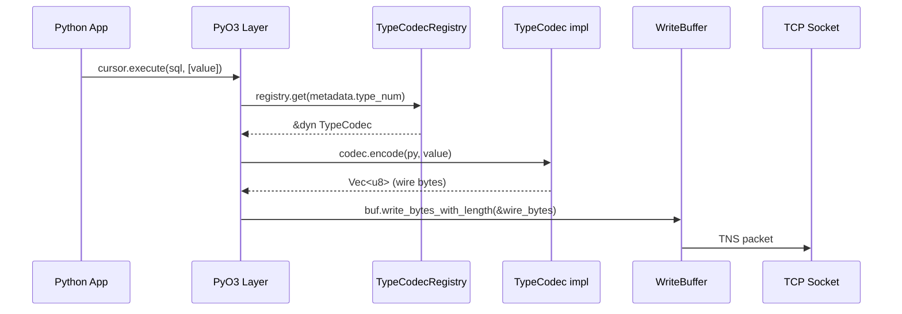
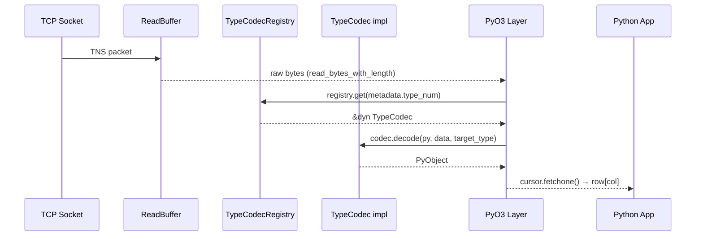

# Tibero Python Driver — Rust Data Conversion Core 설계 문서

> **대상 독자**: Tibero Python 드라이버의 Rust 코어를 개발하는 개발자  
> **범위**: Data Conversion (Python ↔ Wire Format) 한정  
> **기반**: python-oracledb Cython 구조 분석 + Rust 재설계  
> **관련 문서**: [ARCHITECTURE.md](./ARCHITECTURE.md), [DATA_TYPE_CONVERSION.md](./DATA_TYPE_CONVERSION.md)

---

## 1. 설계 목표

| # | 목표 | 설명 |
|---|------|------|
| G1 | **python-oracledb Python API 차용** | `Connection`, `Cursor`, `Var` 등 PEP 249 호환 API를 그대로 사용 |
| G2 | **Rust로 전면 재작성** | Cython 의존 제거, PyO3로 Python FFI |
| G3 | **다형성 기반 타입 시스템** | Oracle Cython의 if-elif 체인을 trait 기반 디스패치로 교체 |
| G4 | **확장 용이성** | 새 타입 추가 시 하나의 impl 블록만 작성 |
| G5 | **Tibero 차이 수용** | Oracle과 wire format이 다른 타입(VECTOR, JSON 등)을 별도 인코딩으로 처리 |

---

## 2. Oracle Cython 구조의 문제점 분석

### 2.1 다중 분기 체인

Oracle Cython은 데이터 변환을 **4개의 거대한 if-elif 체인**으로 처리합니다:

```
[Write 경로]
_write_bind_params_column()     ← ora_type_num 기반 17개 분기
  └─ convert_python_to_oracle_data()  ← ora_type_num 기반 6개 분기

[Read 경로]
_process_column_data()          ← ora_type_num 기반 8개 분기
  └─ read_oracle_data()         ← ora_type_num 기반 10개 분기
     └─ convert_oracle_data_to_python()  ← py_type_num × ora_type_num 2차원 분기
```

**문제점**:

1. **책임이 흩어짐**: NUMBER 타입 하나를 이해하려면 4개 파일, 5개 함수를 추적해야 합니다.
   - `convert_python_to_oracle_data` (Python → 중간 표현)
   - `encode_number` (중간 표현 → wire bytes)
   - `read_oracle_data` → `decode_number` (wire bytes → 중간 표현)
   - `convert_oracle_data_to_python` (중간 표현 → Python)

2. **2단계 분기**: `_write_bind_params_column`에서 `ora_type_num`으로 분기한 뒤, 내부에서 호출하는 `convert_python_to_oracle_data`가 **같은 `ora_type_num`으로 다시 분기**합니다.

3. **비일관적 처리**: 복잡한 타입(CURSOR, LOB, JSON, VECTOR, OBJECT)은 `_process_column_data`에서 직접 처리하고, 단순 타입만 `read_oracle_data` + `convert_oracle_data_to_python`으로 위임합니다. 타입 추가 시 "어디에 코드를 넣어야 하는지" 직관적이지 않습니다.

4. **Cython의 제약**: `cdef` 함수는 Python에서 호출 불가하여, C 레벨 정수 비교가 가상 메서드보다 빠르다는 이유로 if-elif를 선택했습니다. Rust에서는 enum match와 trait vtable 모두 비용이 낮으므로 이 제약이 사라집니다.

### 2.2 중간 표현의 비효율

```c
// Oracle Cython: OracleDataBuffer는 C union
union OracleDataBuffer {
    OracleDate     as_date;
    OracleNumber   as_number;    // 173 byte chars 배열
    double         as_double;
    float          as_float;
    int32_t        as_integer;
    bool           as_bool;
    OracleRawBytes as_raw_bytes; // 포인터 + 길이
    // ...
};
```

- `OracleNumber`는 **decode 후 다시 문자열**로 변환됩니다 (decode_number → chars → `int()` 또는 `float()`). 이중 변환입니다.
- union의 크기는 가장 큰 멤버(`OracleNumber`, 173 bytes)로 고정되어, `bool` 하나를 저장할 때도 173 bytes를 차지합니다.

---

## 3. Rust 재설계: TypeCodec trait

### 3.1 핵심 아이디어

**하나의 타입에 대한 모든 변환 로직을 하나의 구현체에 집중시킵니다.**

Oracle Cython에서 4개 함수에 흩어져 있던 책임을:
```
convert_python_to_oracle_data  ─┐
encode_*                       ─┼─→  TypeCodec::encode()

read_oracle_data / decode_*    ─┤
convert_oracle_data_to_python  ─┘─→  TypeCodec::decode()
```

하나의 trait으로 통합합니다.

### 3.2 TypeCodec trait 정의

```rust
use pyo3::prelude::*;

/// 하나의 DB 타입에 대한 Python ↔ Wire 변환을 담당하는 trait.
///
/// 구현체는 상태를 갖지 않는 unit struct로 정의합니다.
/// 새 타입 추가 시 이 trait만 구현하면 됩니다.
pub trait TypeCodec: Send + Sync {
    /// Python 값 → wire bytes (IN bind)
    ///
    /// `value`는 Python 객체 (int, str, datetime 등).
    /// 반환값은 wire로 전송할 바이트 시퀀스.
    fn encode(&self, py: Python<'_>, value: &Bound<'_, PyAny>) -> Result<Vec<u8>, CodecError>;

    /// Wire bytes → Python 값 (OUT fetch)
    ///
    /// `data`는 서버에서 수신한 raw bytes.
    /// `target_type`은 사용자가 요청한 Python 타입 (outputtypehandler 등으로 변경 가능).
    fn decode(
        &self,
        py: Python<'_>,
        data: &[u8],
        target_type: PyTypeNum,
    ) -> Result<PyObject, CodecError>;

    /// 이 타입의 고정 wire 크기. 가변이면 None.
    fn wire_size(&self) -> Option<usize> {
        None
    }

    /// 이 codec이 처리하는 DB 타입 번호
    fn type_num(&self) -> TypeNum;

    /// 이 타입의 기본 Python 타입 (outputtypehandler 미지정 시)
    fn default_python_type(&self) -> PyTypeNum;
}
```

### 3.3 Oracle Cython과의 대응 관계

```
Oracle Cython                          Rust TypeCodec
─────────────────────────────────────  ──────────────────────────
convert_python_to_oracle_data          ┐
  + encode_number / encode_date / ...  ┘ → TypeCodec::encode()

read_oracle_data                       ┐
  + decode_number / decode_date / ...  │
  + convert_oracle_data_to_python      ┘ → TypeCodec::decode()

_write_bind_params_column 분기         → TypeCodecRegistry::get() + encode()
_process_column_data 분기              → TypeCodecRegistry::get() + decode()
```

**핵심 변화**: 2~3단계 분기가 **1단계 lookup + 메서드 호출**로 대체됩니다.

### 3.4 중간 표현 제거

Oracle Cython은 `OracleData` (union) → 문자열 → Python 객체의 3단계를 거칩니다.

Rust에서는 **wire bytes에서 직접 Python 객체를 생성**합니다:

```
[Oracle Cython]
wire bytes → decode_number → OracleNumber.chars → int("123")
                             ~~~~~~~~~~~~~~~~~~~~~~
                             불필요한 중간 단계

[Rust]
wire bytes → NumberCodec::decode() → PyInt (직접 생성)
```

단, 내부적으로 중간 표현이 필요한 경우(예: NUMBER의 base-100 → digits 변환)는 codec 내부의 private 함수로 캡슐화합니다.

---

## 4. 타입 시스템 상세 설계

### 4.1 타입 식별자

```rust
/// DB 타입 번호 (wire protocol에서 사용하는 타입 코드)
#[derive(Debug, Clone, Copy, PartialEq, Eq, Hash)]
#[repr(u16)]
pub enum TypeNum {
    Varchar    = 1,
    Number     = 2,
    BinaryInteger = 3,
    Float      = 4,   // BINARY_FLOAT
    Double     = 5,   // BINARY_DOUBLE
    Raw        = 6,
    Char       = 7,
    Long       = 8,
    LongRaw    = 9,
    Date       = 12,
    Timestamp  = 180,
    TimestampTz = 181,
    TimestampLtz = 231,
    IntervalDs = 183,
    IntervalYm = 182,
    Boolean    = 252,
    Clob       = 112,
    Blob       = 113,
    Json       = 119,
    Vector     = 127,
    Cursor     = 102,
    Rowid      = 104,
    Object     = 108,
    // Tibero 전용 타입은 여기에 추가
    // TbSpecialType = 300,
}

/// Python 대상 타입 번호 (outputtypehandler에서 라우팅용)
#[derive(Debug, Clone, Copy, PartialEq, Eq, Hash)]
#[repr(u8)]
pub enum PyTypeNum {
    Int,
    Float,
    Decimal,
    Str,
    Bytes,
    Datetime,
    Timedelta,
    Bool,
    IntervalYm,
    // 확장 가능
}
```

### 4.2 Codec 구현체 예시

```rust
/// NUMBER 타입 codec
pub struct NumberCodec;

impl TypeCodec for NumberCodec {
    fn encode(&self, py: Python<'_>, value: &Bound<'_, PyAny>) -> Result<Vec<u8>, CodecError> {
        // 1. Python 값 → 숫자 문자열
        // 2. 숫자 문자열 → wire bytes (base-100 인코딩)
        // Oracle Cython의 convert_python_to_oracle_data + encode_number 를 합침
        let text = python_to_number_string(py, value)?;
        encode_number_wire(text.as_bytes())
    }

    fn decode(
        &self,
        py: Python<'_>,
        data: &[u8],
        target_type: PyTypeNum,
    ) -> Result<PyObject, CodecError> {
        // Wire bytes → Python 객체 (직접 생성)
        // Oracle Cython의 decode_number + convert_number_to_python_* 을 합침
        match target_type {
            PyTypeNum::Int => decode_number_to_int(py, data),
            PyTypeNum::Float => decode_number_to_float(py, data),
            PyTypeNum::Decimal => decode_number_to_decimal(py, data),
            PyTypeNum::Str => decode_number_to_str(py, data),
            _ => Err(CodecError::UnsupportedConversion {
                from: self.type_num(),
                to: target_type,
            }),
        }
    }

    fn wire_size(&self) -> Option<usize> { None }  // 1~22 bytes 가변
    fn type_num(&self) -> TypeNum { TypeNum::Number }
    fn default_python_type(&self) -> PyTypeNum { PyTypeNum::Int }
}


/// BINARY_DOUBLE 타입 codec
pub struct BinaryDoubleCodec;

impl TypeCodec for BinaryDoubleCodec {
    fn encode(&self, py: Python<'_>, value: &Bound<'_, PyAny>) -> Result<Vec<u8>, CodecError> {
        let f: f64 = value.extract()?;
        Ok(encode_binary_double(f))
    }

    fn decode(
        &self,
        py: Python<'_>,
        data: &[u8],
        target_type: PyTypeNum,
    ) -> Result<PyObject, CodecError> {
        let f = decode_binary_double(data)?;
        match target_type {
            PyTypeNum::Float => Ok(f.into_pyobject(py)?.into()),
            PyTypeNum::Str => Ok(f.to_string().into_pyobject(py)?.into()),
            PyTypeNum::Int => Ok((f as i64).into_pyobject(py)?.into()),
            _ => Err(CodecError::UnsupportedConversion {
                from: self.type_num(),
                to: target_type,
            }),
        }
    }

    fn wire_size(&self) -> Option<usize> { Some(8) }
    fn type_num(&self) -> TypeNum { TypeNum::Double }
    fn default_python_type(&self) -> PyTypeNum { PyTypeNum::Float }
}


/// DATE/TIMESTAMP 타입 codec
pub struct DateCodec {
    /// TIMESTAMP이면 fsecond 포함 여부
    include_fsecond: bool,
    /// TIMESTAMP WITH TZ이면 timezone 포함 여부
    include_tz: bool,
}

impl TypeCodec for DateCodec {
    fn encode(&self, py: Python<'_>, value: &Bound<'_, PyAny>) -> Result<Vec<u8>, CodecError> {
        // Python datetime → wire bytes
        // 하나의 구현체가 DATE/TIMESTAMP/TIMESTAMP_TZ 모두 처리
        // (include_fsecond, include_tz 플래그로 구분)
        todo!()
    }

    fn decode(
        &self,
        py: Python<'_>,
        data: &[u8],
        target_type: PyTypeNum,
    ) -> Result<PyObject, CodecError> {
        match target_type {
            PyTypeNum::Datetime => decode_date_to_datetime(py, data, self.include_tz),
            PyTypeNum::Str => decode_date_to_str(py, data, self.include_tz),
            _ => Err(CodecError::UnsupportedConversion {
                from: self.type_num(),
                to: target_type,
            }),
        }
    }

    fn wire_size(&self) -> Option<usize> {
        Some(if self.include_tz { 13 } else if self.include_fsecond { 11 } else { 7 })
    }

    fn type_num(&self) -> TypeNum { TypeNum::Date }
    fn default_python_type(&self) -> PyTypeNum { PyTypeNum::Datetime }
}
```

### 4.3 새 타입 추가 절차

Tibero 전용 타입이나 새 Oracle 호환 타입을 추가하려면:

```
1. TypeNum에 variant 추가          (1줄)
2. struct XxxCodec 정의             (unit struct)
3. impl TypeCodec for XxxCodec     (encode + decode)
4. CODEC_REGISTRY에 등록            (1줄)
```

**예시: Tibero 전용 SPATIAL 타입 추가**

```rust
// 1. TypeNum 추가
pub enum TypeNum {
    // ...기존...
    TbSpatial = 301,
}

// 2 & 3. Codec 정의
pub struct TbSpatialCodec;

impl TypeCodec for TbSpatialCodec {
    fn encode(&self, py: Python<'_>, value: &Bound<'_, PyAny>) -> Result<Vec<u8>, CodecError> {
        // Tibero SPATIAL wire format으로 인코딩
        todo!()
    }

    fn decode(
        &self,
        py: Python<'_>,
        data: &[u8],
        target_type: PyTypeNum,
    ) -> Result<PyObject, CodecError> {
        // Wire → Python dict/tuple 등
        todo!()
    }

    fn type_num(&self) -> TypeNum { TypeNum::TbSpatial }
    fn default_python_type(&self) -> PyTypeNum { PyTypeNum::Str }
}

// 4. 레지스트리 등록 (codec_registry.rs)
registry.register(TypeNum::TbSpatial, Box::new(TbSpatialCodec));
```

끝. 기존 코드 수정 없이 **추가만으로 완료**됩니다.

---

## 5. TypeCodecRegistry — 타입 디스패치

### 5.1 구조

```rust
use std::collections::HashMap;

/// 타입 번호 → codec 매핑 레지스트리
///
/// 프로세스 시작 시 한 번 초기화되고, 이후 읽기 전용.
pub struct TypeCodecRegistry {
    codecs: HashMap<TypeNum, Box<dyn TypeCodec>>,
}

impl TypeCodecRegistry {
    pub fn new() -> Self {
        let mut reg = Self {
            codecs: HashMap::new(),
        };
        // 기본 타입 등록
        reg.register(TypeNum::Number, Box::new(NumberCodec));
        reg.register(TypeNum::BinaryInteger, Box::new(NumberCodec));
        reg.register(TypeNum::Double, Box::new(BinaryDoubleCodec));
        reg.register(TypeNum::Float, Box::new(BinaryFloatCodec));
        reg.register(TypeNum::Date, Box::new(DateCodec::date()));
        reg.register(TypeNum::Timestamp, Box::new(DateCodec::timestamp()));
        reg.register(TypeNum::TimestampTz, Box::new(DateCodec::timestamp_tz()));
        reg.register(TypeNum::Varchar, Box::new(VarcharCodec));
        reg.register(TypeNum::Char, Box::new(VarcharCodec));
        reg.register(TypeNum::Raw, Box::new(RawCodec));
        reg.register(TypeNum::Boolean, Box::new(BooleanCodec));
        reg.register(TypeNum::IntervalDs, Box::new(IntervalDsCodec));
        reg.register(TypeNum::IntervalYm, Box::new(IntervalYmCodec));
        reg.register(TypeNum::Json, Box::new(JsonCodec));
        reg.register(TypeNum::Vector, Box::new(VectorCodec));
        // Tibero 전용 타입
        // reg.register(TypeNum::TbSpatial, Box::new(TbSpatialCodec));
        reg
    }

    pub fn register(&mut self, type_num: TypeNum, codec: Box<dyn TypeCodec>) {
        self.codecs.insert(type_num, codec);
    }

    pub fn get(&self, type_num: TypeNum) -> Result<&dyn TypeCodec, CodecError> {
        self.codecs
            .get(&type_num)
            .map(|c| c.as_ref())
            .ok_or(CodecError::UnsupportedType(type_num))
    }
}
```

### 5.2 사용 — Write 경로 (Oracle의 `_write_bind_params_column` 대체)

```rust
/// IN bind: Python 값 → wire bytes
fn write_bind_column(
    registry: &TypeCodecRegistry,
    py: Python<'_>,
    metadata: &ColumnMetadata,
    value: &Bound<'_, PyAny>,
    buf: &mut WriteBuffer,
) -> Result<(), CodecError> {
    // NULL 처리
    if value.is_none() {
        buf.write_null(metadata.type_num);
        return Ok(());
    }

    // 1단계 lookup + encode (기존의 2~3단계 분기 대체)
    let codec = registry.get(metadata.type_num)?;
    let wire_bytes = codec.encode(py, value)?;
    buf.write_bytes_with_length(&wire_bytes);
    Ok(())
}
```

### 5.3 사용 — Read 경로 (Oracle의 `_process_column_data` + `read_oracle_data` + `convert_oracle_data_to_python` 대체)

```rust
/// OUT fetch: wire bytes → Python 값
fn read_column_data(
    registry: &TypeCodecRegistry,
    py: Python<'_>,
    metadata: &ColumnMetadata,
    buf: &mut ReadBuffer,
) -> Result<PyObject, CodecError> {
    // 길이 및 NULL 체크
    let data = buf.read_bytes_with_length()?;
    if data.is_empty() {
        return Ok(py.None());
    }

    // 1단계 lookup + decode (기존의 3단계 분기 대체)
    let codec = registry.get(metadata.type_num)?;
    let target_type = metadata.python_type.unwrap_or(codec.default_python_type());
    codec.decode(py, &data, target_type)
}
```

### 5.4 호출 흐름 비교

```
[Oracle Cython — Write]
_write_bind_params_column
  ├─ if NUMBER: convert_python_to_oracle_data → encode_number → write
  ├─ if DATE: (직접 encode) → write
  ├─ if VARCHAR: convert_python_to_oracle_data → write
  ├─ if JSON: write_oson
  ├─ if VECTOR: write_vector
  └─ ...17개 분기

[Rust — Write]
write_bind_column
  └─ registry.get(type_num)?.encode(value) → write
     (1줄. 분기 없음.)


[Oracle Cython — Read]
_process_column_data
  ├─ if CURSOR: (직접 처리)
  ├─ if LOB: (직접 처리)
  ├─ if JSON: read_oson
  ├─ if VECTOR: read_vector
  ├─ if OBJECT: read_dbobject
  └─ else:
       read_oracle_data (10개 분기)
         └─ convert_oracle_data_to_python (8×10 분기)

[Rust — Read]
read_column_data
  └─ registry.get(type_num)?.decode(data, target_type) → PyObject
     (1줄. 분기 없음.)
```

---

## 6. 에러 처리

### 6.1 에러 타입

```rust
#[derive(Debug)]
pub enum CodecError {
    /// encode/decode 중 데이터 형식 오류
    InvalidData { type_num: TypeNum, detail: String },

    /// 지원하지 않는 타입
    UnsupportedType(TypeNum),

    /// 지원하지 않는 변환 (예: NUMBER → Timedelta)
    UnsupportedConversion { from: TypeNum, to: PyTypeNum },

    /// 값 범위 초과 (예: NUMBER 40자리 초과)
    Overflow { type_num: TypeNum, detail: String },

    /// Wire bytes 부족 (truncated)
    InsufficientData { expected: usize, actual: usize },

    /// PyO3 변환 오류
    Python(PyErr),
}

impl From<PyErr> for CodecError {
    fn from(err: PyErr) -> Self {
        CodecError::Python(err)
    }
}

impl From<CodecError> for PyErr {
    fn from(err: CodecError) -> Self {
        // CodecError → Python 예외 변환
        match err {
            CodecError::InvalidData { detail, .. } =>
                pyo3::exceptions::PyValueError::new_err(detail),
            CodecError::UnsupportedType(t) =>
                pyo3::exceptions::PyNotImplementedError::new_err(
                    format!("Unsupported DB type: {:?}", t)
                ),
            CodecError::UnsupportedConversion { from, to } =>
                pyo3::exceptions::PyTypeError::new_err(
                    format!("Cannot convert {:?} to {:?}", from, to)
                ),
            CodecError::Overflow { detail, .. } =>
                pyo3::exceptions::PyOverflowError::new_err(detail),
            CodecError::InsufficientData { expected, actual } =>
                pyo3::exceptions::PyValueError::new_err(
                    format!("Expected {} bytes, got {}", expected, actual)
                ),
            CodecError::Python(e) => e,
        }
    }
}
```

### 6.2 Oracle Cython 에러 대응

| Oracle Cython 에러 | Rust CodecError |
|-------|-------|
| `ERR_NUMBER_STRING_OF_ZERO_LENGTH` | `InvalidData { detail: "empty number string" }` |
| `ERR_ORACLE_NUMBER_NO_REPR` | `Overflow { detail: "exceeds 40 digits" }` |
| `ERR_INVALID_NUMBER` | `InvalidData { detail: "invalid character" }` |
| `ERR_INCONSISTENT_DATATYPES` | `UnsupportedConversion { from, to }` |
| `ERR_DB_TYPE_NOT_SUPPORTED` | `UnsupportedType(type_num)` |

---

## 7. Wire Format 추상화 — Tibero 차이 수용

### 7.1 문제

NUMBER, DATE 등의 기본 타입은 Oracle과 동일한 wire format을 사용하지만,
VECTOR, JSON 등은 인코딩이 다릅니다.

### 7.2 해결: codec 단위 교체

TypeCodecRegistry에 등록하는 codec 구현체를 바꾸면 됩니다:

```rust
// Oracle 호환 JSON
registry.register(TypeNum::Json, Box::new(OsonCodec));

// Tibero 전용 JSON (포맷이 다름)
registry.register(TypeNum::Json, Box::new(TbJsonCodec));
```

`TypeCodec` trait의 `encode`/`decode` 인터페이스가 동일하므로, **호출하는 쪽 코드는 변경 불필요**합니다.

### 7.3 Oracle/Tibero 공유 타입 vs 분기 타입

| 분류 | 타입 | Codec | 비고 |
|------|------|-------|------|
| **공유** | NUMBER | `NumberCodec` | Wire format 동일 |
| **공유** | DATE/TIMESTAMP | `DateCodec` | Wire format 동일 |
| **공유** | BINARY_FLOAT/DOUBLE | `BinaryFloatCodec` / `BinaryDoubleCodec` | Wire format 동일 |
| **공유** | INTERVAL_DS/YM | `IntervalDsCodec` / `IntervalYmCodec` | Wire format 동일 |
| **공유** | VARCHAR/CHAR/RAW | `VarcharCodec` / `RawCodec` | Wire format 동일 |
| **공유** | BOOLEAN | `BooleanCodec` | Wire format 동일 |
| **분기** | JSON | `OsonCodec` vs `TbJsonCodec` | 인코딩 차이 |
| **분기** | VECTOR | `OracleVectorCodec` vs `TbVectorCodec` | 인코딩 차이 |
| **미정** | OBJECT | — | 추후 설계 |
| **미정** | LOB | — | Data Conversion 범위 외 (protocol 레벨) |

---

## 8. 모듈 구조

```
tibero-python-driver/
├── Cargo.toml
├── pyproject.toml
└── src/
    ├── lib.rs                  # PyO3 모듈 진입점
    ├── types.rs                # TypeNum, PyTypeNum, ColumnMetadata
    ├── error.rs                # CodecError
    ├── registry.rs             # TypeCodecRegistry
    ├── codec/
    │   ├── mod.rs              # pub trait TypeCodec 정의
    │   ├── number.rs           # NumberCodec
    │   ├── date.rs             # DateCodec (DATE/TIMESTAMP/TIMESTAMP_TZ)
    │   ├── binary_float.rs     # BinaryFloatCodec, BinaryDoubleCodec
    │   ├── interval.rs         # IntervalDsCodec, IntervalYmCodec
    │   ├── varchar.rs          # VarcharCodec, RawCodec
    │   ├── boolean.rs          # BooleanCodec
    │   ├── json.rs             # TbJsonCodec (Tibero)
    │   └── vector.rs           # TbVectorCodec (Tibero)
    └── buffer/
        ├── mod.rs              # Length encoding/decoding
        ├── read.rs             # ReadBuffer
        └── write.rs            # WriteBuffer
```

각 파일의 크기가 작고 독립적이므로, 한 타입의 변경이 다른 타입에 영향을 주지 않습니다.

---

## 9. 데이터 흐름 전체 그림

### 9.1 Write 경로 (Python → Wire)



### 9.2 Read 경로 (Wire → Python)



---

## 10. 성능 고려사항

### 10.1 Dynamic Dispatch 비용

`&dyn TypeCodec`는 vtable을 통한 간접 호출입니다. 그러나:

- **호출 빈도**: column당 1회 lookup + 1회 메서드 호출. row당 반복은 있지만, encode/decode 자체의 연산 비용이 vtable 비용보다 수백 배 큼.
- **캐싱**: column metadata에 codec 참조를 미리 해석(resolve)하여 fetch 루프에서 HashMap lookup을 제거 가능:

```rust
/// 컬럼별 사전 해석된 codec 참조
struct ResolvedColumn<'a> {
    codec: &'a dyn TypeCodec,
    target_type: PyTypeNum,
    // ... 기타 metadata
}

// fetch 루프 (HashMap lookup 없음)
for row in rows {
    for col in &resolved_columns {
        let value = col.codec.decode(py, &data, col.target_type)?;
        // ...
    }
}
```

### 10.2 Zero-Copy 경로

VARCHAR/RAW fetch는 wire bytes를 복사 없이 Python bytes로 변환할 수 있습니다:

```rust
impl TypeCodec for VarcharCodec {
    fn decode(
        &self,
        py: Python<'_>,
        data: &[u8],
        target_type: PyTypeNum,
    ) -> Result<PyObject, CodecError> {
        match target_type {
            // data 슬라이스에서 직접 Python str 생성 (zero-copy에 가까움)
            PyTypeNum::Str => {
                let s = std::str::from_utf8(data)
                    .map_err(|e| CodecError::InvalidData {
                        type_num: TypeNum::Varchar,
                        detail: e.to_string(),
                    })?;
                Ok(s.into_pyobject(py)?.into())
            }
            PyTypeNum::Bytes => Ok(data.into_pyobject(py)?.into()),
            _ => Err(CodecError::UnsupportedConversion {
                from: self.type_num(),
                to: target_type,
            }),
        }
    }
}
```

### 10.3 Static Dispatch 대안 (필요 시)

성능이 극단적으로 중요한 hot path에서는 enum dispatch로 전환할 수 있습니다:

```rust
/// 컴파일 타임에 결정되는 codec enum (vtable 없음)
enum StaticCodec {
    Number(NumberCodec),
    Double(BinaryDoubleCodec),
    Date(DateCodec),
    // ...
}

impl StaticCodec {
    fn decode(&self, py: Python<'_>, data: &[u8], target: PyTypeNum)
        -> Result<PyObject, CodecError>
    {
        match self {
            Self::Number(c) => c.decode(py, data, target),
            Self::Double(c) => c.decode(py, data, target),
            Self::Date(c) => c.decode(py, data, target),
            // ...
        }
    }
}
```

이 방식은 `dyn TypeCodec`보다 빠르지만, 새 타입 추가 시 enum variant + match arm을 수동으로 추가해야 합니다. 확장성과 성능의 트레이드오프이며, **초기에는 `dyn TypeCodec`으로 시작하고 프로파일링 후 필요 시 전환**을 권장합니다.

---

## 11. NULL 처리

### 11.1 Write

```rust
fn write_bind_column(/* ... */) -> Result<(), CodecError> {
    if value.is_none() {
        buf.write_null(metadata.type_num);
        return Ok(());
    }
    // ...
}
```

NULL은 codec에 도달하기 전에 처리됩니다. codec은 non-NULL 값만 받습니다.

### 11.2 Read

```rust
fn read_column_data(/* ... */) -> Result<PyObject, CodecError> {
    let data = buf.read_bytes_with_length()?;
    if data.is_empty() {
        return Ok(py.None());   // NULL
    }
    // ...
}
```

### 11.3 Oracle Cython과의 차이

Oracle Cython에서는 `OracleData.is_null` 필드를 설정하고 이를 검사합니다.
Rust에서는 빈 데이터(`&[]`)를 NULL로 처리하여, 별도 플래그가 불필요합니다.

---

## 12. 길이 인코딩 (Length Prefix Protocol)

Wire에서 각 값은 길이가 앞에 붙습니다. Oracle/Tibero 공통:

```rust
impl WriteBuffer {
    /// 길이 prefix + 데이터 기록
    pub fn write_bytes_with_length(&mut self, data: &[u8]) {
        let len = data.len();
        if len == 0 {
            self.write_u8(0x00);  // NULL
        } else if len <= 252 {
            self.write_u8(len as u8);
            self.write_all(data);
        } else {
            // Chunked: 0xFE 이후 254-byte 청크로 분할
            self.write_u8(0xFE);
            for chunk in data.chunks(252) {
                self.write_u8(chunk.len() as u8);
                self.write_all(chunk);
            }
            self.write_u8(0x00);  // 종료 마커
        }
    }
}

impl ReadBuffer {
    /// 길이 prefix 읽기 + 데이터 반환
    pub fn read_bytes_with_length(&mut self) -> Result<Vec<u8>, CodecError> {
        let first = self.read_u8()?;
        match first {
            0x00 | 0xFF => Ok(vec![]),  // NULL
            0xFE => {
                // Chunked read
                let mut result = Vec::new();
                loop {
                    let chunk_len = self.read_u8()? as usize;
                    if chunk_len == 0 { break; }
                    result.extend_from_slice(self.read_exact(chunk_len)?);
                }
                Ok(result)
            }
            n => {
                let data = self.read_exact(n as usize)?;
                Ok(data.to_vec())
            }
        }
    }
}
```

---

## 13. 테스트 전략

### 13.1 단위 테스트 (Rust)

각 codec의 `encode`/`decode`를 독립적으로 테스트합니다.

```rust
#[cfg(test)]
mod tests {
    use super::*;

    #[test]
    fn test_number_encode_zero() {
        let codec = NumberCodec;
        Python::with_gil(|py| {
            let value = 0i64.into_pyobject(py).unwrap();
            let result = codec.encode(py, value.as_ref()).unwrap();
            assert_eq!(result, vec![0x80]);
        });
    }

    #[test]
    fn test_number_decode_to_int() {
        let codec = NumberCodec;
        Python::with_gil(|py| {
            let data = &[0xC1, 0x02]; // 1
            let result = codec.decode(py, data, PyTypeNum::Int).unwrap();
            let val: i64 = result.extract(py).unwrap();
            assert_eq!(val, 1);
        });
    }

    #[test]
    fn test_number_decode_to_float() {
        let codec = NumberCodec;
        Python::with_gil(|py| {
            let data = &[0xC1, 0x02]; // 1
            let result = codec.decode(py, data, PyTypeNum::Float).unwrap();
            let val: f64 = result.extract(py).unwrap();
            assert_eq!(val, 1.0);
        });
    }
}
```

### 13.2 Roundtrip 테스트

```rust
#[test]
fn test_number_roundtrip() {
    let codec = NumberCodec;
    Python::with_gil(|py| {
        let values: Vec<i64> = vec![0, 1, -1, 42, 9999, -9999];
        for v in values {
            let obj = v.into_pyobject(py).unwrap();
            let encoded = codec.encode(py, obj.as_ref()).unwrap();
            let decoded = codec.decode(py, &encoded, PyTypeNum::Int).unwrap();
            let result: i64 = decoded.extract(py).unwrap();
            assert_eq!(result, v, "roundtrip failed for {}", v);
        }
    });
}
```

### 13.3 Registry 통합 테스트

```rust
#[test]
fn test_registry_dispatch() {
    let registry = TypeCodecRegistry::new();
    Python::with_gil(|py| {
        let codec = registry.get(TypeNum::Number).unwrap();
        let value = 42i64.into_pyobject(py).unwrap();
        let encoded = codec.encode(py, value.as_ref()).unwrap();
        assert!(!encoded.is_empty());
    });
}
```

### 13.4 테스트 매트릭스

| 테스트 유형 | 도구 | 대상 |
|------------|------|------|
| **Unit (Rust)** | `#[test]` | 각 codec의 encode/decode |
| **Roundtrip** | `#[test]` | encode → decode가 원본을 복원하는지 |
| **Property** | `proptest` | 무작위 입력으로 panic/corruption 탐지 |
| **Registry** | `#[test]` | TypeNum → codec 매핑 정확성 |
| **Python FFI** | `pytest` | PyO3를 통한 Python 호출 |
| **Wire Compat** | `pytest` | Tibero DB 실 연결 E2E |

---

## 부록 A. Oracle Cython vs Rust 설계 비교 요약

| 관점 | Oracle Cython | Rust (본 설계) |
|------|---------------|----------------|
| **타입 디스패치** | if-elif 체인 (4개 함수) | `TypeCodecRegistry` + trait vtable |
| **타입별 코드 위치** | 4개 파일에 분산 | 1개 파일 (codec/xxx.rs) |
| **중간 표현** | `OracleData` union (173 bytes) | 없음 (wire → Python 직접) |
| **새 타입 추가** | 4개 함수에 분기 추가 | 1개 struct + impl + 등록 1줄 |
| **NULL 처리** | `is_null` 플래그 | 빈 데이터 = NULL |
| **다형성** | 없음 (C 정수 비교) | trait object (`dyn TypeCodec`) |
| **성능 최적화** | C 레벨 switch | vtable (필요 시 enum dispatch) |
| **Python ↔ Rust** | Cython 직접 | PyO3 |

## 부록 B. TypeCodec trait 메서드 요약

| 메서드 | 용도 | 필수 |
|--------|------|------|
| `encode(py, value)` | Python → wire bytes | O |
| `decode(py, data, target_type)` | wire bytes → Python | O |
| `wire_size()` | 고정 크기 (None이면 가변) | 기본값 None |
| `type_num()` | DB 타입 번호 | O |
| `default_python_type()` | 기본 Python 타입 | O |

## 부록 C. DbObject 컨텍스트 차이

Oracle Cython에서 BOOLEAN과 BINARY_INTEGER는 **DbObject 내부**와 **일반 컨텍스트**에서 다른 wire format을 사용합니다:

| 타입 | 일반 컨텍스트 | DbObject 내부 |
|------|--------------|---------------|
| BOOLEAN | `0x00`/`0x0101` | uint32 big-endian |
| BINARY_INTEGER | `encode_number` (가변 길이) | uint32 big-endian (4 bytes 고정) |

이 차이는 `TypeCodec::encode`/`decode`에 `context: CodecContext` 파라미터를 추가하거나, DbObject 전용 codec을 별도로 등록하여 해결할 수 있습니다:

```rust
pub enum CodecContext {
    Default,
    DbObject,
}

// 방법 1: 컨텍스트 파라미터
fn encode(&self, py: Python<'_>, value: &Bound<'_, PyAny>, ctx: CodecContext)
    -> Result<Vec<u8>, CodecError>;

// 방법 2: 별도 codec
registry.register_for_context(
    TypeNum::Boolean,
    CodecContext::DbObject,
    Box::new(DbObjectBooleanCodec),
);
```

어느 방법이든 범위가 **DbObject 구현 시점** (Phase 4-3에 해당)에 결정하면 됩니다.
